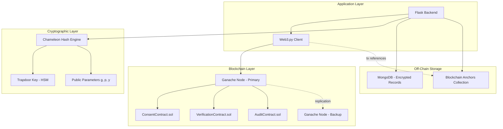
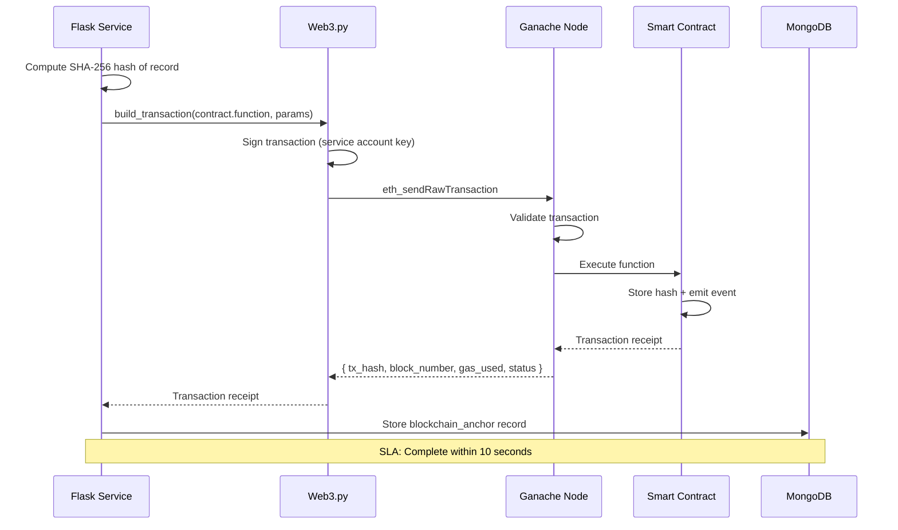
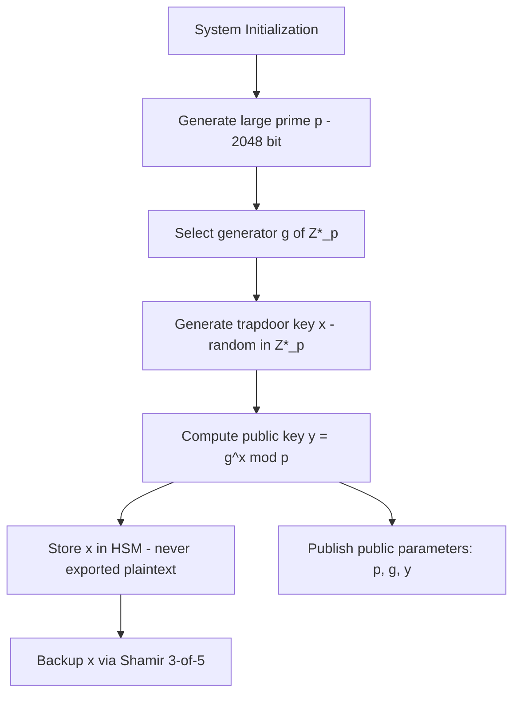
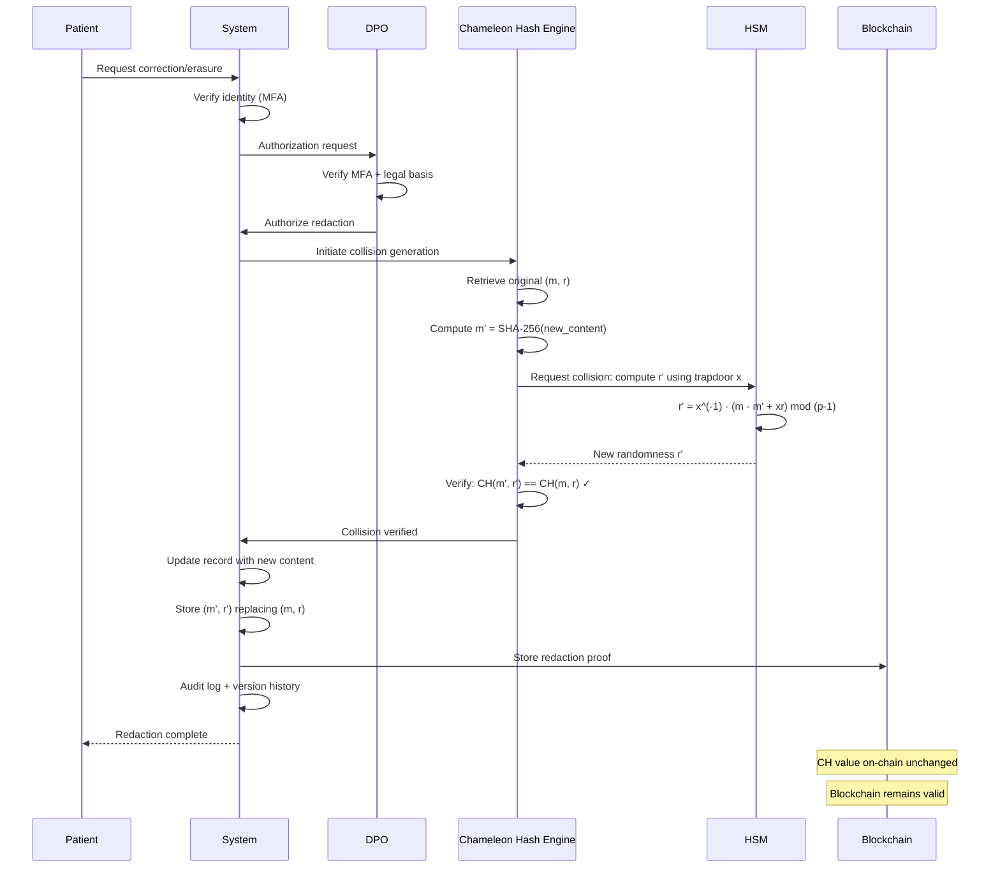
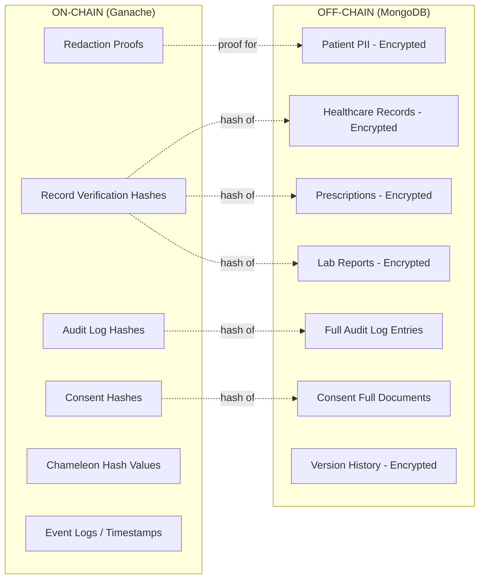
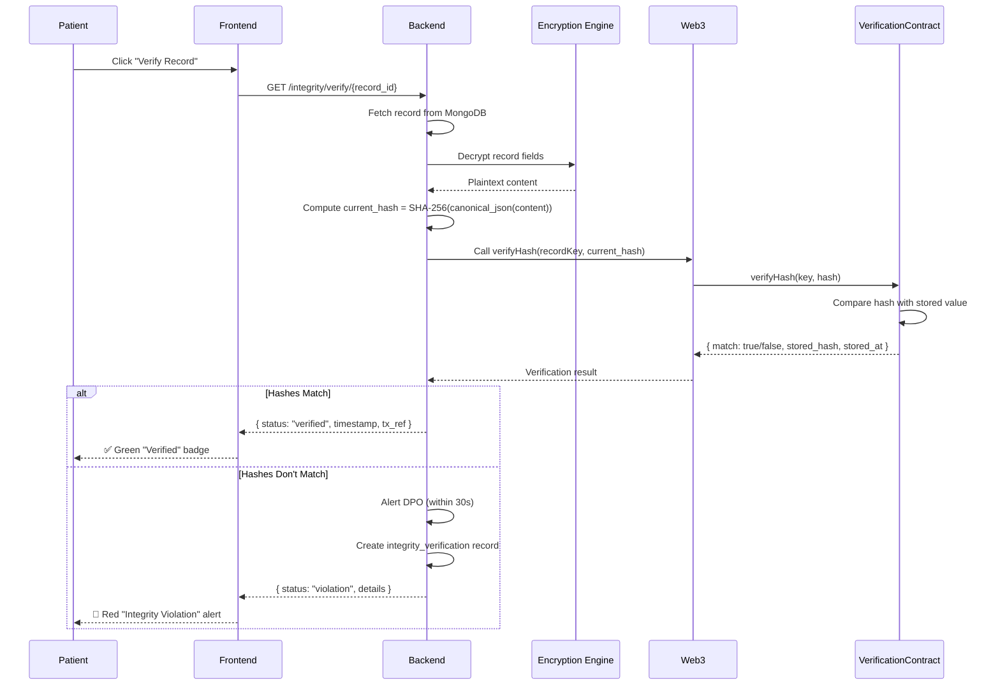
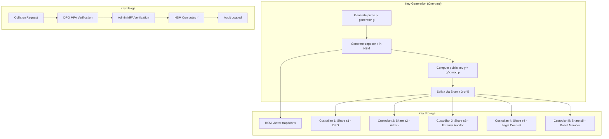
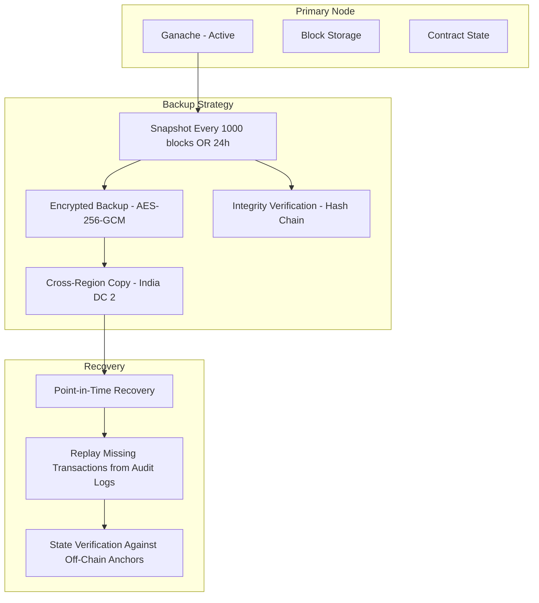

# Blockchain Design Document

## DPDP Compliant Redactable Blockchain Based Healthcare and Pharmacy Management System

---

## 1. Blockchain Architecture Overview

### 1.1 Design Philosophy

This system employs a **hybrid blockchain architecture** combining:
- **Ethereum-compatible local blockchain** (Ganache) for immutable hash storage
- **Chameleon Hashing** for DPDP-compliant authorized redaction
- **Off-chain data storage** (MongoDB) for actual healthcare records

The blockchain serves as a **verification layer**, not a data store. No personal health information resides on-chain. Only cryptographic hashes, consent proofs, and audit anchors are stored in smart contracts.

### 1.2 Core Architectural Principle

```
Healthcare Data (Off-Chain)  ←→  Verification Hashes (On-Chain)
       MongoDB                         Ganache/Ethereum
       [Encrypted PII]                 [SHA-256 Hashes Only]
```

This separation satisfies three competing requirements:
1. **DPDP Right to Erasure** — Data can be redacted off-chain
2. **Blockchain Immutability** — Hash proofs remain permanently verifiable
3. **Chameleon Hash Consistency** — Authorized modifications preserve hash validity

### 1.3 Architecture Diagram



---

## 2. Ethereum Network Design

### 2.1 Ganache Configuration

| Parameter | Value | Rationale |
|-----------|-------|-----------|
| Network ID | 1337 | Local development standard |
| Gas Limit | 6,721,975 | Default Ganache block gas limit |
| Block Time | Instant mining | Deterministic for SLA compliance |
| Accounts | 10 pre-funded | System accounts for contract interaction |
| Mnemonic | Configured per deployment | Reproducible account generation |
| Port | 8545 (HTTP JSON-RPC) | Standard Ethereum RPC |
| DB Path | `/data/ganache/` | Persistent blockchain state |

### 2.2 Node Structure

```
Primary Node (India DC - Region 1):
├── Ganache Core (persistent mode)
├── Deployed Smart Contracts (3)
├── Transaction Pool
├── Block Storage
└── Event Logs

Backup Node (India DC - Region 2):
├── State Snapshot Receiver
├── Read-Only RPC (verification queries)
└── Recovery Readiness
```

### 2.3 Account Allocation

| Account Index | Purpose | Access Control |
|---------------|---------|----------------|
| Account[0] | Contract Deployer / System Admin | Admin only |
| Account[1] | ConsentContract caller | Backend service |
| Account[2] | VerificationContract caller | Backend service |
| Account[3] | AuditContract caller | Backend service |
| Account[4] | Emergency recovery | Multi-party (DPO + Admin) |
| Account[5-9] | Reserved for scaling | Unused |

### 2.4 Transaction Lifecycle



---

## 3. Smart Contract Architecture

### 3.1 ConsentContract

**Purpose**: Immutable on-chain record of all consent lifecycle events. Provides verifiable proof that consent was granted, modified, or withdrawn at a specific time.

**State Variables**:
```
mapping(bytes32 => ConsentRecord) public consents
  - Key: keccak256(patient_address, purpose, timestamp)
  - Value: ConsentRecord struct

mapping(address => bytes32[]) public patientConsents
  - Patient address → list of consent record keys

mapping(address => bool) public authorizedCallers
  - Addresses permitted to write consent records

address public owner
uint256 public totalConsents
```

**ConsentRecord Struct**:
```
struct ConsentRecord {
    bytes32 consentHash;      // SHA-256 hash of full consent document
    address patient;           // Patient Ethereum address (derived from UUID)
    string purpose;            // Consent type identifier
    string action;             // "grant" | "modify" | "withdraw"
    string scope;              // Data categories (comma-separated)
    uint256 timestamp;         // Block timestamp
    uint256 expiryTimestamp;   // Consent expiry
    bool active;               // Current status
}
```

**Functions**:

| Function | Access | Parameters | Emits | Description |
|----------|--------|------------|-------|-------------|
| `storeConsent` | Authorized callers | consentHash, patient, purpose, action, scope, expiry | ConsentStored | Record new consent event |
| `withdrawConsent` | Authorized callers | consentKey, withdrawalHash | ConsentWithdrawn | Mark consent as withdrawn |
| `verifyConsent` | Public (view) | consentKey | — | Return consent record for verification |
| `getPatientConsents` | Public (view) | patient | — | Return all consent keys for a patient |
| `addAuthorizedCaller` | Owner only | caller | CallerAdded | Authorize new backend service |
| `removeAuthorizedCaller` | Owner only | caller | CallerRemoved | Revoke authorization |

**Events**:
```
event ConsentStored(bytes32 indexed consentKey, address indexed patient, string purpose, string action, uint256 timestamp)
event ConsentWithdrawn(bytes32 indexed consentKey, address indexed patient, bytes32 withdrawalHash, uint256 timestamp)
event CallerAdded(address indexed caller)
event CallerRemoved(address indexed caller)
```

---

### 3.2 VerificationContract

**Purpose**: Stores cryptographic hashes of healthcare records, prescriptions, lab reports, and version entries. Enables on-chain integrity verification and tamper detection.

**State Variables**:
```
mapping(bytes32 => VerificationRecord) public records
  - Key: keccak256(resource_type, resource_id)
  - Value: VerificationRecord struct

mapping(bytes32 => bytes32[]) public recordHistory
  - Record key → ordered list of historical hashes

mapping(bytes32 => RedactionProof) public redactionProofs
  - Record key → redaction proof (if redacted)

mapping(address => bool) public authorizedCallers
address public owner
uint256 public totalRecords
```

**VerificationRecord Struct**:
```
struct VerificationRecord {
    bytes32 dataHash;          // Current SHA-256 hash of record
    string resourceType;       // Collection name
    string resourceId;         // Document UUID
    uint256 storedAt;          // Block timestamp when stored
    uint256 lastUpdated;       // Last hash update timestamp
    uint256 version;           // Hash version counter
    bool redacted;             // Whether record has been redacted
}
```

**RedactionProof Struct**:
```
struct RedactionProof {
    bytes32 chameleonHashValue;  // CH(m,r) = CH(m',r') preserved value
    bytes32 previousHash;        // Hash before redaction
    bytes32 redactedHash;        // Hash after redaction
    string legalBasis;           // DPDP section reference
    uint256 redactedAt;          // Redaction timestamp
    address authorizedBy;        // DPO/Admin address
}
```

**Functions**:

| Function | Access | Parameters | Emits | Description |
|----------|--------|------------|-------|-------------|
| `storeHash` | Authorized callers | recordKey, dataHash, resourceType, resourceId | HashStored | Store new verification hash |
| `updateHash` | Authorized callers | recordKey, newHash | HashUpdated | Update hash (correction/modification) |
| `storeRedactionProof` | Authorized callers | recordKey, proof | RedactionRecorded | Store redaction proof on-chain |
| `verifyHash` | Public (view) | recordKey, providedHash | — | Compare provided hash against stored |
| `getRecord` | Public (view) | recordKey | — | Return full verification record |
| `getRecordHistory` | Public (view) | recordKey | — | Return all historical hashes |
| `batchVerify` | Public (view) | recordKeys[], hashes[] | — | Verify multiple records in one call |

**Events**:
```
event HashStored(bytes32 indexed recordKey, bytes32 dataHash, string resourceType, uint256 timestamp)
event HashUpdated(bytes32 indexed recordKey, bytes32 previousHash, bytes32 newHash, uint256 version, uint256 timestamp)
event RedactionRecorded(bytes32 indexed recordKey, bytes32 chameleonHash, string legalBasis, address authorizedBy, uint256 timestamp)
```

---

### 3.3 AuditContract

**Purpose**: Stores hashes of audit log entries, providing immutable proof that audit events occurred and were not tampered with. Supports batch verification for compliance audits.

**State Variables**:
```
mapping(bytes32 => AuditAnchor) public auditAnchors
  - Key: keccak256(audit_log_id)
  - Value: AuditAnchor struct

mapping(uint256 => bytes32[]) public dailyAnchors
  - Day number → list of anchor keys for that day

mapping(address => bool) public authorizedCallers
address public owner
uint256 public totalAnchors
uint256 public latestAnchorTimestamp
```

**AuditAnchor Struct**:
```
struct AuditAnchor {
    bytes32 logHash;           // SHA-256 hash of audit log entry
    bytes32 previousLogHash;   // Hash chain: previous entry's hash
    string actionType;         // Audit action category
    string severity;           // info | warning | critical
    uint256 timestamp;         // Block timestamp
}
```

**Functions**:

| Function | Access | Parameters | Emits | Description |
|----------|--------|------------|-------|-------------|
| `storeAuditHash` | Authorized callers | anchorKey, logHash, previousLogHash, actionType, severity | AuditAnchored | Store audit log hash |
| `verifyAuditHash` | Public (view) | anchorKey, providedHash | — | Verify audit entry integrity |
| `verifyChain` | Public (view) | anchorKeys[] | — | Verify hash chain continuity |
| `getDailyAnchors` | Public (view) | dayNumber | — | Get all anchors for a day |
| `getAnchor` | Public (view) | anchorKey | — | Return full anchor record |

**Events**:
```
event AuditAnchored(bytes32 indexed anchorKey, bytes32 logHash, string actionType, string severity, uint256 timestamp)
event ChainIntegrityVerified(uint256 fromDay, uint256 toDay, bool valid)
```

---

## 4. Chameleon Hashing Architecture

### 4.1 Mathematical Foundation

**Definition**: A Chameleon Hash function is a trapdoor collision-resistant hash. Anyone can compute the hash, but only the holder of the trapdoor key (secret key) can find collisions.

**Formula**:
```
CH(m, r) = g^m · y^r mod p

Where:
  - p : Large prime number (2048-bit minimum)
  - g : Generator of multiplicative group Z*_p
  - y : Public key (y = g^x mod p, where x is the secret/trapdoor key)
  - m : Message (SHA-256 hash of the record content)
  - r : Randomness value (256-bit random integer)
  - x : Trapdoor key (secret key held by authorized parties)
```

**Properties**:
1. **Collision Resistance (without trapdoor)**: Computationally infeasible to find (m₁, r₁) ≠ (m₂, r₂) such that CH(m₁, r₁) = CH(m₂, r₂) without knowing x
2. **Trapdoor Collision (with secret key)**: Given (m, r) and a new message m', compute r' such that CH(m, r) = CH(m', r')
3. **Uniformity**: Output distribution is computationally indistinguishable from random

### 4.2 Key Generation



**Key Parameters Storage**:

| Parameter | Storage Location | Access |
|-----------|-----------------|--------|
| p (prime) | Application config | Public |
| g (generator) | Application config | Public |
| y (public key) | Application config | Public |
| x (trapdoor/secret key) | HSM | DPO + Admin (multi-party) |
| x backup shares | 5 custodians (Shamir) | 3-of-5 reconstruction |

### 4.3 Hash Computation (Standard Operation)

For any record stored in the system:

```
Input: record_content (plaintext of the healthcare record)
Process:
  1. m = SHA-256(canonical_json(record_content))    // Message digest
  2. r = SecureRandom(256 bits)                     // Random value
  3. CH = g^m · y^r mod p                           // Chameleon hash
  4. Store: { chameleon_hash: CH, message_hash: m, randomness: r (encrypted) }
  5. Anchor CH on blockchain via VerificationContract
```

### 4.4 Collision Generation (Authorized Redaction)

When a correction or erasure is authorized:

```
Given: Original (m, r) where CH(m, r) = g^m · y^r mod p
Goal:  Find r' for new message m' such that CH(m', r') = CH(m, r)

Derivation:
  CH(m, r) = CH(m', r')
  g^m · y^r = g^m' · y^r' (mod p)
  g^m · g^(xr) = g^m' · g^(xr') (mod p)     [since y = g^x]
  m + xr ≡ m' + xr' (mod p-1)                [discrete log]
  xr' ≡ m - m' + xr (mod p-1)
  r' = x^(-1) · (m - m' + xr) mod (p-1)     [requires trapdoor key x]

Result: New randomness r' that preserves the chameleon hash value
```

**Critical Observation**: Computing r' requires knowledge of the trapdoor key x. Without x, finding a collision is computationally infeasible (equivalent to solving the discrete logarithm problem).

### 4.5 Authorized Redaction Workflow



---

## 5. Redactable Blockchain Design

### 5.1 Supporting DPDP Rights While Preserving Blockchain Properties

| DPDP Right | Challenge | Solution | Integrity Preserved? |
|------------|-----------|----------|---------------------|
| Right to Correction | Modifying data invalidates traditional hash | Chameleon collision: compute r' for corrected m' | ✅ CH value unchanged |
| Right to Erasure | Deleted data makes hash unverifiable | Replace with redaction marker + collision | ✅ CH value unchanged |
| Consent Withdrawal | Revocation needs proof but data removed | Consent hash remains on-chain, data redacted off-chain | ✅ Consent proof preserved |

### 5.2 Correction Workflow (Right to Correction)

```
State Before:
  - Off-chain: Record R with content C (encrypted)
  - On-chain: CH(m, r) where m = SHA-256(C)

Correction to C' (new content):
  1. m' = SHA-256(C')
  2. Using trapdoor x: r' = x^(-1) · (m - m' + xr) mod (p-1)
  3. Verify: CH(m', r') = CH(m, r) = unchanged value on blockchain ✓
  4. Update off-chain: Replace C with C' (encrypted)
  5. Update metadata: Store new (m', r'), archive old (m, r)
  6. Version history: Record old value, new value, reason, authorizer
  7. Blockchain: Hash on-chain unchanged — chain validity preserved

Result: Data corrected, blockchain valid, full audit trail maintained
```

### 5.3 Erasure Workflow (Right to Erasure)

```
State Before:
  - Off-chain: Record R with content C (encrypted)
  - On-chain: CH(m, r) where m = SHA-256(C)

Erasure:
  1. C' = "[REDACTED]" (redaction marker)
  2. m' = SHA-256("[REDACTED]")
  3. Using trapdoor x: r' = x^(-1) · (m - m' + xr) mod (p-1)
  4. Verify: CH(m', r') = CH(m, r) = unchanged value on blockchain ✓
  5. Update off-chain: Replace C with "[REDACTED]" marker
  6. Archive: Store original C in encrypted compliance archive
  7. Store redaction proof on-chain via VerificationContract.storeRedactionProof()
  8. Propagate: Notify processors to delete shared copies

Result: Data erased, blockchain valid, erasure provable, audit preserved
```

### 5.4 Consent Withdrawal Workflow

```
State Before:
  - Off-chain: Consent record with status "active"
  - On-chain: ConsentContract has consent hash

Withdrawal:
  1. Update off-chain: consent.status = "withdrawn", set withdrawn_at
  2. Compute new consent_hash = SHA-256(updated consent record)
  3. Call ConsentContract.withdrawConsent(key, withdrawal_hash)
  4. On-chain: Original consent record preserved + withdrawal event emitted
  5. Access revocation: Immediately block data access for withdrawn purpose
  6. Notification: Alert affected processors within 60 seconds

Result: Consent withdrawn, proof of original grant preserved, withdrawal recorded
```

### 5.5 Property Preservation Analysis

| Property | Traditional Blockchain | This System (Chameleon) | How Preserved |
|----------|----------------------|------------------------|---------------|
| Immutability | Absolute | Controlled mutability (authorized only) | Trapdoor key access restricted to DPO+Admin |
| Chain Validity | Hash chain unbroken | Hash chain unbroken (CH value unchanged) | Collision maintains same output |
| Non-repudiation | All actions permanent | All actions logged + blockchain-anchored | Audit trail + chameleon hash operation log |
| Verifiability | Anyone can verify | Anyone can verify (same CH value) | Public verification against on-chain CH |
| Auditability | Transaction history | Transaction history + redaction proofs | RedactionRecorded events on-chain |

---

## 6. Blockchain Data Model

### 6.1 On-Chain vs Off-Chain Storage



### 6.2 Why Healthcare Records Never Reside On-Chain

| Reason | Explanation |
|--------|-------------|
| **DPDP Right to Erasure** | On-chain data cannot be deleted. Storing records on-chain would make erasure impossible. |
| **Data Volume** | Healthcare records are large (KB-MB). Blockchain storage is expensive and slow. |
| **Encryption Incompatibility** | AES-256-GCM encrypted data changes with each encryption (random IV). On-chain storage of ciphertext provides no verification value. |
| **Privacy by Design** | Even on a private blockchain, data exposure risk exists. Hashes reveal nothing about content. |
| **Key Rotation** | Re-encryption during key rotation would require on-chain updates — infeasible. |
| **Regulatory Compliance** | Indian data localization requires data residency proof. Blockchain distributed across nodes complicates residency assurance. |

**Design Decision**: Store only fixed-length SHA-256 hashes (32 bytes) on-chain. Full data resides in encrypted MongoDB with field-level AES-256-GCM.

### 6.3 Anchor Types

| Anchor Type | Smart Contract | Trigger Event | Stored Data |
|-------------|---------------|---------------|-------------|
| Consent Hash | ConsentContract | Consent grant/modify/withdraw | SHA-256(consent_document) |
| Consent Receipt Hash | ConsentContract | Receipt generation | SHA-256(receipt_content) |
| Record Verification | VerificationContract | Record create/update | SHA-256(record_plaintext) |
| Prescription Hash | VerificationContract | Prescription create/dispense | SHA-256(prescription_content) |
| Lab Report Hash | VerificationContract | Report creation | SHA-256(lab_report_content) |
| Redaction Proof | VerificationContract | Authorized redaction | CH value + legal basis |
| Audit Hash | AuditContract | Every audit log entry | SHA-256(audit_entry) |
| Breach Trail | AuditContract | Breach confirmation | SHA-256(breach_trail) |
| Grievance Resolution | AuditContract | Grievance resolved | SHA-256(resolution_record) |
| Processor Authorization | ConsentContract | Processor registered | SHA-256(DPA_record) |

---

## 7. Verification Architecture

### 7.1 Record Verification Flow



### 7.2 Integrity Status Logic

```
function determineIntegrityStatus(record, blockchain_hash):
    current_hash = SHA-256(canonical_json(decrypt(record)))
    
    if record.redacted == true:
        // For redacted records, verify against chameleon hash
        ch_record = get_chameleon_record(record._id)
        if ch_record.status == "completed":
            return VERIFIED_REDACTED  // Lawful redaction confirmed
        else:
            return INTEGRITY_VIOLATION  // Unauthorized modification
    
    if current_hash == blockchain_hash:
        return VERIFIED  // ✅ Record matches blockchain
    
    // Check if this is a chameleon-hash-authorized modification
    ch_records = get_chameleon_records(record._id, status="completed")
    if ch_records exists:
        latest_ch = ch_records.latest()
        if current_hash == latest_ch.modified_message_hash:
            return VERIFIED_MODIFIED  // ✅ Authorized modification
    
    return INTEGRITY_VIOLATION  // 🔴 Unauthorized tampering detected
```

### 7.3 Tamper Detection Logic

| Scenario | Detection Method | Response |
|----------|-----------------|----------|
| Unauthorized DB modification | SHA-256 mismatch with on-chain hash | Alert DPO + patient within 30s |
| Audit log tampering | Hash chain break (previous_log_hash mismatch) | Critical alert, quarantine log |
| Consent record alteration | Consent hash mismatch with ConsentContract | Alert DPO, block consent operations |
| Chameleon hash parameter tampering | CH verification fails (CH(m',r') ≠ stored CH) | Critical alert, lock redaction system |
| Blockchain state corruption | Node hash verification failure | Trigger recovery from backup |

---

## 8. Chameleon Hash Key Governance

### 8.1 Key Custody Model



### 8.2 DPO Responsibilities

| Responsibility | Procedure | Frequency |
|----------------|-----------|-----------|
| Authorize redaction | Verify legal basis, approve via MFA | Per request |
| Key usage audit | Review chameleon hash operation log | Weekly |
| Key rotation decision | Assess risk, initiate rotation if compromised | As needed |
| Custodian management | Ensure 5 custodians available, replace if departed | Quarterly review |
| Recovery testing | Participate in Shamir reconstruction test | Quarterly |
| Compliance reporting | Report redaction statistics to board | Monthly |

### 8.3 Multi-Person Approval

Every Chameleon Hash collision generation requires:

1. **Requestor verification** — Patient identity confirmed via MFA
2. **DPO authorization** — DPO authenticates with MFA, reviews legal basis
3. **System verification** — Backend confirms DPO role and authorization
4. **HSM execution** — Trapdoor computation occurs within HSM boundary
5. **Audit capture** — Full operation logged with cryptographic proof

No single person can initiate and complete a redaction without at least one additional authorized party.

---

## 9. Smart Contract Security

### 9.1 Security Controls

| Threat | Mitigation | Contract Feature |
|--------|------------|-----------------|
| Reentrancy | No external calls after state changes | Checks-Effects-Interactions pattern |
| Unauthorized access | Caller whitelist + owner control | `onlyAuthorized` modifier |
| Integer overflow | Solidity 0.8+ built-in checks | Automatic revert on overflow |
| Front-running | No financial incentive on private network | Ganache instant mining eliminates mempool |
| Event manipulation | Events emitted after state change | Emit only on successful writes |
| Denial of service | Gas limits, no loops over unbounded data | Fixed-size operations only |
| Upgrade attacks | Contracts immutable post-deployment | No proxy pattern (simplicity) |

### 9.2 Access Control Pattern

```
modifier onlyOwner() {
    require(msg.sender == owner, "Not owner");
    _;
}

modifier onlyAuthorized() {
    require(authorizedCallers[msg.sender], "Not authorized");
    _;
}

// All state-changing functions use onlyAuthorized
// Only owner can add/remove authorized callers
// Owner set at deployment, cannot be changed
```

### 9.3 Transaction Validation

Before any on-chain write, the Flask backend validates:
1. **Hash format**: Must be valid 32-byte hex string
2. **Caller authorization**: Service account matches authorized caller
3. **Idempotency**: Check if anchor already exists (prevent duplicates)
4. **Gas estimation**: Pre-estimate gas, abort if abnormal
5. **Receipt verification**: Confirm transaction succeeded (status = 1)

---

## 10. Blockchain Failure Recovery

### 10.1 Failure Scenarios and Recovery

| Failure | Detection | Recovery Procedure | RTO |
|---------|-----------|-------------------|-----|
| Ganache process crash | Health check failure (30s interval) | Auto-restart with persistent DB | < 5 min |
| Disk corruption | Blockchain state verification fails | Restore from latest snapshot | < 4 hours |
| Network partition | RPC timeout from Flask backend | Queue transactions, retry on reconnection | < 10 min |
| Transaction failure | Receipt status = 0 | Retry with exponential backoff (3 attempts) | < 30s |
| Smart contract bug | Unexpected revert pattern | Deploy patched contract, migrate state | < 24 hours |
| Complete node loss | Both primary and backup unavailable | Reconstruct from backup snapshot + audit logs | < 4 hours |

### 10.2 Backup Architecture



### 10.3 Recovery Validation

After any blockchain recovery:
1. Verify all contract addresses match expected deployment
2. Batch-verify a sample of blockchain_anchors against restored state
3. Confirm event log continuity (no gaps in anchored hashes)
4. DPO sign-off on recovery integrity report

---

## 11. Blockchain Gap Analysis

### 11.1 Coverage Assessment

| Capability | Status | Notes |
|------------|--------|-------|
| Consent hash anchoring | ✅ Complete | ConsentContract with full lifecycle |
| Record verification | ✅ Complete | VerificationContract with batch verify |
| Audit immutability | ✅ Complete | AuditContract with chain verification |
| Chameleon hash redaction | ✅ Complete | Full mathematical framework + workflow |
| Backup and recovery | ✅ Complete | RPO 1h, RTO 4h, quarterly testing |
| Smart contract security | ✅ Complete | Access control, reentrancy protection |
| Multi-party key governance | ✅ Complete | Shamir 3-of-5, HSM, dual authorization |
| Scalability to production Ethereum | ⚠️ Limited | Ganache is academic; production would need L2/sidechain |
| Formal verification of contracts | ⚠️ Out of scope | Recommended for production deployment |
| Cross-chain interoperability | ❌ Not addressed | Single-chain design (appropriate for scope) |

### 11.2 Limitations (Academic Context)

| Limitation | Impact | Mitigation |
|------------|--------|------------|
| Ganache is not production Ethereum | No real consensus, no true decentralization | Backup/recovery compensates; architecture portable to mainnet |
| Single-node primary | No Byzantine fault tolerance | Backup node + snapshot recovery |
| No gas cost optimization | Not relevant on local network | Would need optimization for mainnet |
| No formal smart contract verification | Potential undiscovered bugs | Comprehensive testing + access control |

---

## 12. Research Contribution Analysis

### 12.1 Differentiation from Traditional Blockchain Systems

| Aspect | Traditional Blockchain | This System |
|--------|----------------------|-------------|
| Immutability | Absolute — data cannot be changed | Controlled — authorized modifications via Chameleon Hash |
| Privacy compliance | Conflicts with GDPR/DPDP erasure rights | Designed for compliance from the ground up |
| Data storage | Data on-chain (transparent) | Hash-only on-chain, data encrypted off-chain |
| Key governance | Distributed consensus | Centralized trapdoor with multi-party controls |
| Verification | Full data verification | Hash-based verification (privacy-preserving) |

### 12.2 Differentiation from Traditional Healthcare Systems

| Aspect | Traditional Healthcare IT | This System |
|--------|--------------------------|-------------|
| Data integrity | Trust-based (database admins) | Cryptographic proof (blockchain verification) |
| Audit trail | Application-level logs (mutable) | Blockchain-anchored, hash-chained (immutable) |
| Patient control | Limited visibility | Full data sovereignty, consent management |
| Modification detection | Manual audit only | Real-time automated tamper detection |
| Record correction | Overwrite without proof | Version-preserved with chameleon hash consistency |

### 12.3 Differentiation from Traditional Consent Management

| Aspect | Traditional Consent Systems | This System |
|--------|----------------------------|-------------|
| Consent proof | Database record (alterable) | Blockchain-anchored hash (immutable proof) |
| Withdrawal enforcement | Application-level | Smart contract event + immediate access revocation |
| Receipt verification | Paper/PDF (forgeable) | QR-linked blockchain transaction (verifiable) |
| Consent for minors | Basic guardian flag | Full guardian management with age-transition workflow |
| Purpose limitation | Policy-based | Technically enforced (consent-augmented RBAC) |
| Consent expiry | Manual tracking | Automated enforcement with 7-day advance notification |

### 12.4 Novel Contributions

1. **Chameleon Hash Integration with DPDP Compliance**: First documented architecture combining Chameleon Hashing specifically with Indian DPDP Act requirements for healthcare
2. **Dual Verification Model**: Combination of hash-chain (audit logs) and blockchain anchoring provides two independent integrity verification paths
3. **Consent-Augmented Access Control**: RBAC + blockchain-verified consent + purpose limitation as a unified authorization model
4. **Redaction-Preserving Audit**: Erasure of data while maintaining provable audit trail that data existed and was lawfully removed
5. **Privacy Score as Compliance Metric**: Quantitative patient-facing metric derived from consent coverage, encryption status, and verification recency
