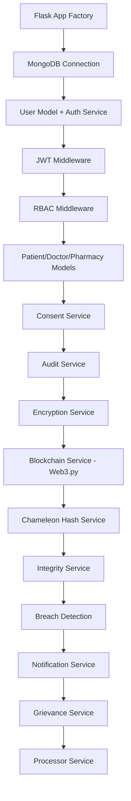
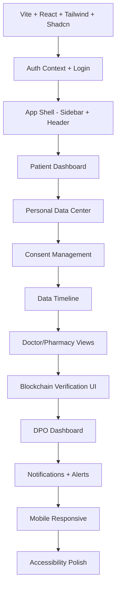
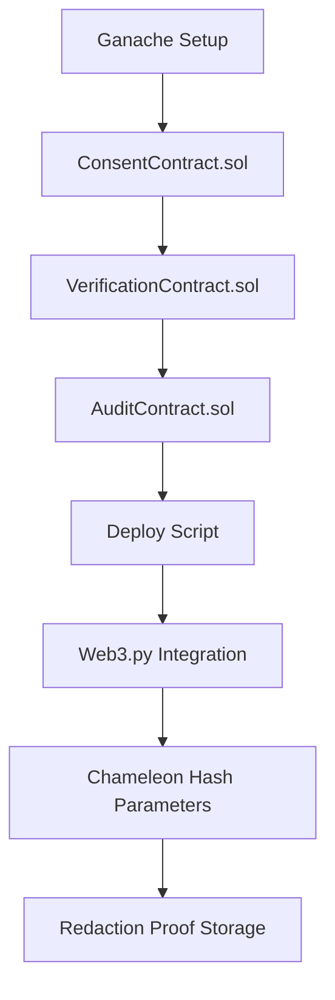

# Implementation Roadmap

## DPDP Compliant Redactable Blockchain Based Healthcare and Pharmacy Management System

---

## 1. Project Overview

### 1.1 Team Configuration

| Role | Person | Responsibility |
|------|--------|----------------|
| Developer A | Full-Stack + Blockchain | Backend (Flask), Smart Contracts, Blockchain integration, Chameleon Hashing |
| Developer B | Full-Stack + Frontend | React frontend, UI/UX, API integration, Testing |
| Shared | Both | Database design, security implementation, documentation, deployment |

### 1.2 Timeline Summary

| Phase | Duration | Weeks |
|-------|----------|-------|
| Phase 1-2: Foundation + Auth | 2 weeks | Week 1-2 |
| Phase 3-4: Healthcare Data + Consent | 3 weeks | Week 3-5 |
| Phase 5-6: Audit + Encryption | 2 weeks | Week 6-7 |
| Phase 7-8: Blockchain + Chameleon Hash | 3 weeks | Week 8-10 |
| Phase 9-10: Integrity + DPDP Features | 2 weeks | Week 11-12 |
| Phase 11-12: Notifications + UI Polish | 2 weeks | Week 13-14 |
| Phase 13-14: Testing + Deployment | 2 weeks | Week 15-16 |
| **Total** | **16 weeks** | |

---

## 2. Development Phases

### Phase 1: Foundation Setup (Week 1)

**Goal**: Project scaffolding, development environment, database initialization.

| Task | Owner | Deliverable |
|------|-------|-------------|
| Initialize Flask project (app factory pattern) | Dev A | `backend/app/__init__.py` + config |
| Initialize React + Vite + TypeScript + Tailwind | Dev B | `frontend/` with Shadcn UI configured |
| Docker Compose setup (MongoDB + Ganache + Flask) | Dev A | `docker-compose.yml` |
| MongoDB schema initialization (collections + indexes) | Dev A | Seed scripts for all 18 collections |
| Shadcn UI component setup + design tokens | Dev B | Theme config, global styles |
| Project folder structure (backend + frontend) | Both | Complete directory tree |
| API documentation setup (Swagger/OpenAPI) | Dev A | `/api/docs` endpoint |
| Git repository + branching strategy | Both | `main`, `develop`, feature branches |

**Exit Criteria**: Flask app starts, React app renders, MongoDB connected, Ganache running.

---

### Phase 2: Authentication & RBAC (Week 2)

**Goal**: User registration, login, JWT, session management, role-based access.

| Task | Owner | Deliverable |
|------|-------|-------------|
| User registration endpoint (bcrypt, UUID) | Dev A | `POST /api/v1/auth/register` |
| Login endpoint (JWT RS256, refresh tokens) | Dev A | `POST /api/v1/auth/login` |
| JWT middleware (validation, expiry) | Dev A | `auth_middleware.py` |
| Session management service (binding, timeout) | Dev A | `session_service.py` |
| RBAC middleware (5 roles, permission matrix) | Dev A | `rbac_middleware.py` |
| Account lockout (5 attempts / 15 min) | Dev A | Lockout logic in auth_service |
| Rate limiting middleware (token bucket) | Dev A | `rate_limit_middleware.py` |
| Login page UI | Dev B | `LoginPage.tsx` |
| Registration page UI (age verification) | Dev B | `RegisterPage.tsx` |
| Auth context + protected routes | Dev B | `AuthContext.tsx`, route guards |
| Role-based navigation (sidebar) | Dev B | `Sidebar.tsx`, `RoleBasedNav.tsx` |

**Exit Criteria**: All 5 roles can register, login, receive JWT, access role-appropriate routes.

---

### Phase 3: Healthcare Data Management (Week 3-4)

**Goal**: Patient profile CRUD, healthcare records, prescriptions, lab reports.

| Task | Owner | Deliverable |
|------|-------|-------------|
| Patient profile endpoints (create, read, update) | Dev A | `patients` blueprint |
| Healthcare records endpoints (CRUD) | Dev A | `doctors` blueprint (consultations) |
| Prescriptions endpoints (create, dispense) | Dev A | `pharmacy` blueprint |
| Lab reports endpoints (create, review) | Dev A | Lab report routes |
| Doctor workflow (consent-gated patient access) | Dev A | Consent check in access flow |
| Pharmacy workflow (prescription dispensing) | Dev A | Dispense endpoint |
| Patient Dashboard UI | Dev B | `DashboardPage.tsx` |
| Personal Data Center UI (categorized view) | Dev B | `PersonalDataCenter.tsx` |
| Doctor Dashboard + patient search | Dev B | `DoctorDashboard.tsx` |
| Consultation form UI | Dev B | `ConsultationForm.tsx` |
| Pharmacy Dashboard + dispensing | Dev B | `PharmacyDashboard.tsx` |
| Break-glass access UI + flow | Dev B | `EmergencyAccess.tsx` |

**Exit Criteria**: Full CRUD for all clinical data. Doctor/Pharmacy workflows functional with consent gates.

---

### Phase 4: Consent Management (Week 5)

**Goal**: Full consent lifecycle — grant, modify, withdraw, expire, receipts.

| Task | Owner | Deliverable |
|------|-------|-------------|
| Consent service (grant, modify, withdraw) | Dev A | `consent_service.py` |
| Consent expiry scheduler | Dev A | Background job for auto-expiry |
| Consent receipt generation (UUID, hash) | Dev A | Receipt creation logic |
| Consent enforcement in data access | Dev A | Pre-access consent check |
| Purpose limitation enforcement | Dev A | Category filtering per consent scope |
| Consent Management Center UI | Dev B | `ConsentCenter.tsx` |
| Consent cards (per type, with actions) | Dev B | `ConsentCard.tsx` |
| Grant consent dialog | Dev B | Grant flow with scope selection |
| Withdraw confirmation dialog | Dev B | Destructive action confirmation |
| Active Data Sharing Dashboard | Dev B | `ActiveSharing.tsx` |
| Consent receipt download (PDF) | Dev B | PDF generation + QR code |

**Exit Criteria**: All 6 consent types manageable. Withdrawal immediately revokes access. Receipts downloadable.

---

### Phase 5: Audit Logging (Week 6)

**Goal**: Immutable audit trail for every operation, searchable by patient/DPO.

| Task | Owner | Deliverable |
|------|-------|-------------|
| Audit service (auto-log every operation) | Dev A | `audit_service.py` |
| Audit middleware (pre/post request logging) | Dev A | `audit_middleware.py` |
| Hash chain implementation (previous_log_hash) | Dev A | Chain linking logic |
| Data access log materialization | Dev A | data_access_logs sync |
| Audit log search/filter API | Dev A | Search endpoint with pagination |
| Audit Log Viewer UI | Dev B | `AuditLogsPage.tsx` (DataTable) |
| Data Usage Timeline UI | Dev B | `DataTimeline.tsx` (vertical timeline) |
| Timeline filters (date, role, category) | Dev B | `TimelineFilter.tsx` |
| DPO audit monitoring dashboard | Dev B | `DPODashboard.tsx` (partial) |

**Exit Criteria**: Every CRUD operation generates audit log. Timeline displays access events. Hash chain verifiable.

---

### Phase 6: AES Encryption Layer (Week 7)

**Goal**: Field-level AES-256-GCM encryption for all sensitive data.

| Task | Owner | Deliverable |
|------|-------|-------------|
| Encryption service (encrypt/decrypt) | Dev A | `encryption_service.py` |
| Per-patient key generation | Dev A | Key generation on registration |
| Key management store (separate from data) | Dev A | Key storage infrastructure |
| Encrypt existing patient data (migration) | Dev A | Migration script |
| Encrypt healthcare records, prescriptions, labs | Dev A | Repository-level encryption |
| Key rotation scheduler (90-day) | Dev A | Rotation background job |
| Decryption at API boundary (transparent) | Dev A | Repository interceptor |
| Encryption status display in UI | Dev B | 🔒 icons on encrypted fields |
| Key rotation status (DPO dashboard) | Dev B | Widget showing rotation health |

**Exit Criteria**: All PII encrypted in MongoDB. Decryption transparent to service layer. Key rotation functional.

---

### Phase 7: Blockchain Integration (Week 8-9)

**Goal**: Smart contract deployment, Web3.py integration, hash anchoring.

| Task | Owner | Deliverable |
|------|-------|-------------|
| ConsentContract.sol development | Dev A | Solidity contract + tests |
| VerificationContract.sol development | Dev A | Solidity contract + tests |
| AuditContract.sol development | Dev A | Solidity contract + tests |
| Contract deployment script | Dev A | `deploy.py` (Ganache) |
| Web3.py service (transaction management) | Dev A | `blockchain_service.py` |
| Consent hash anchoring | Dev A | Auto-anchor on consent events |
| Record hash anchoring | Dev A | Auto-anchor on record create/update |
| Audit hash anchoring | Dev A | Auto-anchor on audit log creation |
| Blockchain verification endpoint | Dev A | `GET /integrity/verify/:id` |
| Blockchain Explorer UI | Dev B | `BlockchainExplorer.tsx` |
| Transaction reference display | Dev B | `TransactionRef.tsx` component |
| Blockchain status indicators | Dev B | Connection health widget |

**Exit Criteria**: 3 contracts deployed on Ganache. All events produce blockchain anchors within 10 seconds.

---

### Phase 8: Chameleon Hashing Integration (Week 10)

**Goal**: Implement CH(m,r) = g^m · y^r mod p, collision generation, redaction workflow.

| Task | Owner | Deliverable |
|------|-------|-------------|
| Chameleon hash engine (key gen, hash, collision) | Dev A | `chameleon_hash_service.py` |
| Parameter generation (p, g, x, y) | Dev A | System initialization script |
| Collision generation (trapdoor computation) | Dev A | r' computation with secret key |
| Redaction workflow (DPO authorization) | Dev A | Multi-step redaction API |
| Correction workflow (update + collision) | Dev A | Correction endpoint with CH |
| Version history integration | Dev A | `version_service.py` |
| Chameleon Hash visualization UI | Dev B | `ChameleonVisual.tsx` |
| Traditional vs Chameleon comparison | Dev B | Side-by-side visual |
| DPO redaction authorization UI | Dev B | Authorization dialog + MFA |
| Version history UI (diff view) | Dev B | `VersionHistory.tsx` |

**Exit Criteria**: Corrections and erasures produce valid chameleon hash collisions. Blockchain remains valid after redaction.

---

### Phase 9: Integrity Verification (Week 11)

**Goal**: On-demand and batch record verification against blockchain hashes.

| Task | Owner | Deliverable |
|------|-------|-------------|
| Integrity service (single + batch verify) | Dev A | `integrity_service.py` |
| Tamper detection logic | Dev A | Hash comparison + alert generation |
| DPO alert on integrity violation | Dev A | Auto-notification within 30s |
| Scheduled batch verification | Dev A | Background job (daily) |
| Integrity Verification screen | Dev B | `IntegrityVerification.tsx` |
| Verified/Violation status badges | Dev B | `IntegrityBadge.tsx` (green/red) |
| Batch verify button + progress | Dev B | Progress indicator UI |
| How-it-works explanation panel | Dev B | Educational visual |

**Exit Criteria**: Patient can verify any record. Batch verify checks all records. Tampered records show red alert.

---

### Phase 10: DPDP Compliance Features (Week 12)

**Goal**: Erasure workflow, grievance handling, minors protection, processor management.

| Task | Owner | Deliverable |
|------|-------|-------------|
| Right to erasure full workflow | Dev A | Erasure endpoint + CH + blockchain proof |
| Grievance submission + tracking API | Dev A | `grievance_service.py` |
| Grievance SLA enforcement (15 days) | Dev A | Escalation scheduler |
| Minors protection (guardian linking) | Dev A | `minors_service.py` |
| Third-party processor registration API | Dev A | `processor_service.py` |
| Data residency verification | Dev A | `residency_service.py` |
| Grievance Portal UI | Dev B | `GrievancePortal.tsx` |
| Guardian Dashboard | Dev B | `GuardianDashboard.tsx` |
| DPO Processor Management UI | Dev B | `ProcessorManagement.tsx` |
| Privacy Score computation + display | Dev B | `PrivacyScoreGauge.tsx` |

**Exit Criteria**: Full erasure workflow functional. Grievances trackable. Minor accounts linked to guardians.

---

### Phase 11: Notifications & Breach Management (Week 13)

**Goal**: Real-time notifications, breach detection, incident management.

| Task | Owner | Deliverable |
|------|-------|-------------|
| Notification service (create, deliver) | Dev A | `notification_service.py` |
| Breach detection rules engine | Dev A | `breach_service.py` |
| Incident creation + containment actions | Dev A | Auto-response logic |
| DPO notification (≤ 30s SLA) | Dev A | Priority notification dispatch |
| Patient notification (≤ 60s SLA) | Dev A | Patient alert generation |
| Notification Center UI | Dev B | `NotificationBell.tsx` + panel |
| Notification priority badges | Dev B | Critical/high/medium/low styling |
| DPO Breach Center UI | Dev B | `BreachCenter.tsx` |
| Incident timeline + containment display | Dev B | Incident detail view |

**Exit Criteria**: Notifications generated for all events. Breach detection triggers alerts within SLA.

---

### Phase 12: UI/UX Refinement (Week 14)

**Goal**: Polish, responsiveness, accessibility, loading states, error handling.

| Task | Owner | Deliverable |
|------|-------|-------------|
| Mobile responsive layouts | Dev B | All screens responsive (320-1200px) |
| Accessibility audit (WCAG 2.1 AA) | Dev B | Focus management, ARIA, contrast |
| Loading skeletons for all pages | Dev B | Skeleton components |
| Error boundaries + error pages | Dev B | Graceful error handling |
| Empty states for all lists/tables | Dev B | Empty state illustrations |
| Toast notifications polish | Dev B | Consistent toast behavior |
| API error handling (backend) | Dev A | Standardized error responses |
| API documentation completion | Dev A | Full OpenAPI spec |
| Performance optimization (queries) | Dev A | Index tuning, query optimization |
| Data seeding (demo data) | Both | Realistic seed data for demo |

**Exit Criteria**: All screens render correctly on mobile. No accessibility violations. Demo data loaded.

---

### Phase 13: Testing & Validation (Week 15)

**Goal**: Unit tests, integration tests, property-based tests, security testing.

| Task | Owner | Deliverable |
|------|-------|-------------|
| Backend unit tests (services) | Dev A | pytest tests for all services |
| API integration tests | Dev A | Endpoint-level tests |
| Smart contract tests | Dev A | Solidity test suite |
| Chameleon hash property tests | Dev A | Hypothesis tests (collision correctness) |
| Encryption roundtrip tests | Dev A | Encrypt → decrypt verification |
| Frontend component tests | Dev B | React Testing Library |
| E2E workflow tests | Dev B | Key user journeys |
| Security testing (OWASP Top 10) | Both | Manual + automated scan |
| Blockchain verification tests | Dev A | Tamper detection validation |
| DPDP compliance validation | Both | Checklist verification |
| Performance/load testing | Both | Response time benchmarks |

**Exit Criteria**: >80% test coverage. All critical paths tested. No high-severity security findings.

---

### Phase 14: Deployment (Week 16)

**Goal**: Production-ready deployment, documentation, demo preparation.

| Task | Owner | Deliverable |
|------|-------|-------------|
| Docker production images | Dev A | Optimized Dockerfiles |
| Docker Compose production config | Dev A | Production compose file |
| Environment configuration | Dev A | .env templates, secrets management |
| Database backup automation | Dev A | Backup scripts + verification |
| Deployment documentation | Dev A | README with setup instructions |
| Demo script preparation | Both | Guided walkthrough script |
| Final documentation review | Both | All design docs updated |
| Project report compilation | Both | Academic submission package |
| Video demo recording | Both | 15-min system walkthrough |
| Viva preparation | Both | Q&A preparation |

**Exit Criteria**: System deployable with single `docker-compose up`. Demo script covers all features.

---

## 3. Development Dependencies

### 3.1 Backend Build Order

### 3.2 Frontend Build Order

### 3.3 Smart Contract Build Order

---

## 4. Security Testing Strategy

| Test Type | Tools | Coverage |
|-----------|-------|----------|
| Static Analysis | Bandit (Python), ESLint security plugin | Code-level vulnerabilities |
| Dependency Audit | `pip-audit`, `npm audit` | Known CVEs in dependencies |
| Authentication Testing | Manual + automated | JWT forgery, session hijack, brute force |
| Authorization Testing | Manual | RBAC bypass, consent bypass, privilege escalation |
| Injection Testing | SQLMap adaptation (NoSQL), manual | NoSQL injection, XSS, command injection |
| Encryption Validation | Unit tests | Key isolation, rotation, GCM tag verification |
| Smart Contract Audit | Manual review + Slither (if available) | Reentrancy, access control, overflow |
| Rate Limit Testing | Artillery / custom script | Verify throttling behavior |
| Breach Detection Testing | Simulated attacks | Verify detection rules trigger correctly |

---

## 5. Blockchain Testing Strategy

| Test | Method | Success Criteria |
|------|--------|------------------|
| Contract deployment | Automated deploy script | All 3 contracts deploy without error |
| Consent anchoring | Integration test | Hash stored and retrievable within 10s |
| Verification hash storage | Integration test | storeHash + verifyHash round-trip passes |
| Batch verification | Integration test | Multiple records verified in single call |
| Chameleon collision | Property test | CH(m,r) == CH(m',r') for all test cases |
| Collision without trapdoor | Negative test | Infeasible to find collision without key |
| Redaction proof storage | Integration test | Proof stored and retrievable |
| Event emission | Log analysis | All events emitted with correct parameters |
| Gas usage | Benchmarking | All functions execute within block gas limit |
| Recovery from backup | Manual test | Restored state matches original anchors |

---

## 6. DPDP Compliance Validation Plan

| Validation Item | Test Method | Evidence |
|-----------------|-------------|----------|
| Consent before processing | Attempt access without consent → verify denial | Audit log showing 403 |
| Purpose limitation | Request categories outside scope → verify denial | Audit log + DPO alert |
| Right to access | Patient downloads all data → verify completeness | JSON export matches DB |
| Right to correction | Correct field → verify version preserved + CH valid | Version history + blockchain |
| Right to erasure | Request deletion → verify redaction + blockchain proof | [REDACTED] in DB + on-chain proof |
| Consent withdrawal | Withdraw → verify immediate access revocation | Access denied within 5s |
| Breach notification | Simulate breach → verify notification SLA | Timestamps in notification records |
| Grievance handling | Submit grievance → verify acknowledgment SLA | Acknowledgment within 24h |
| Minors protection | Register minor → verify guardian consent required | Account inactive without guardian |
| Data residency | Verify all data stored in India DC | data_residency field checks |
| Audit completeness | Perform operations → verify all logged | 100% operation coverage in audit_logs |

---

## 7. Performance Testing Plan

| Metric | Target | Test Method |
|--------|--------|-------------|
| Login response time | < 500ms | Load test with 50 concurrent users |
| Data retrieval (with decryption) | < 800ms | Single patient full data fetch |
| Consent grant (with blockchain) | < 10s end-to-end | Grant consent + verify anchor |
| Batch integrity verification | < 60s for 50 records | Trigger batch verify |
| Audit log query (with filters) | < 1s for 10K logs | Search with date range + type |
| Dashboard load time | < 2s | Full dashboard render |
| Data export (JSON) | < 30s | Export all patient data |
| Concurrent users | 50 simultaneous | Load test scenario |

---

## 8. Risk Register

| Risk | Probability | Impact | Mitigation |
|------|------------|--------|------------|
| Chameleon hash math complexity | Medium | High | Start early (Phase 8), use reference implementation |
| Ganache instability | Low | Medium | Persistent mode + backup node |
| AES key management complexity | Medium | High | Start with simplified key store, add HSM layer |
| Time overrun on blockchain phase | Medium | High | Blockchain is critical path — start in Week 8, buffer exists |
| MongoDB performance with encryption | Low | Medium | Index unencrypted fields, benchmark early |
| Shadcn UI learning curve | Low | Low | Well-documented, extensive examples |
| Smart contract bugs | Medium | High | Thorough testing, keep contracts simple |
| Integration complexity (15+ services) | High | Medium | Integration testing from Week 6 onwards |
| Demo data preparation | Low | Medium | Start seeding in Week 12 |

---

## 9. Milestones

| Milestone | Week | Deliverable | Demo-Ready? |
|-----------|------|-------------|-------------|
| M1: Auth Working | Week 2 | Login, register, role-based navigation | Partial |
| M2: Clinical Data | Week 4 | Patient, Doctor, Pharmacy workflows | Yes (no security) |
| M3: Consent + Audit | Week 6 | Full consent lifecycle + audit trail | Yes (no encryption) |
| M4: Encryption Live | Week 7 | All PII encrypted, transparent decryption | Yes |
| M5: Blockchain Anchored | Week 9 | Smart contracts deployed, hashes on-chain | Yes |
| M6: Chameleon Hash | Week 10 | Redaction working with chain validity | Yes (core novelty) |
| M7: DPDP Complete | Week 12 | All DPDP rights implementated | Yes (full compliance) |
| M8: Production Ready | Week 14 | Notifications, breach detection, UI polished | Yes (demo-ready) |
| M9: Tested & Deployed | Week 16 | All tests passing, Docker deployment | Final submission |

---

## 10. Demo Preparation Plan

### 10.1 Demo Script (15 minutes)

| Segment | Duration | Content |
|---------|----------|---------|
| Introduction | 1 min | System overview, DPDP context, architecture diagram |
| Patient Registration | 1 min | Register, show deny-all defaults |
| Consent Grant | 2 min | Grant healthcare treatment consent, show receipt, blockchain tx |
| Doctor Access | 2 min | Doctor searches patient, consent verified, creates consultation |
| Pharmacy Dispensing | 1 min | Prescription access (consent-gated), dispense medication |
| Data Timeline | 1 min | Show patient who accessed their data |
| Integrity Verification | 2 min | Verify record, show green badge, show blockchain hash |
| Chameleon Hash Demo | 3 min | Correct a record, show CH collision, blockchain unchanged |
| Right to Erasure | 1 min | Request deletion, show redaction + proof |
| DPO Dashboard | 1 min | Compliance metrics, breach alerts, SLA tracking |

### 10.2 Demo Data Requirements

| Entity | Count | Purpose |
|--------|-------|---------|
| Patients | 5 | Different consent states, one minor |
| Doctors | 2 | Different specializations |
| Pharmacy Staff | 1 | Dispensing demonstration |
| Admin | 1 | System management |
| DPO | 1 | Compliance oversight |
| Consents | 15+ | Mix of active, withdrawn, expired |
| Healthcare Records | 10+ | Multiple consultations |
| Prescriptions | 5+ | Active and dispensed |
| Audit Logs | 100+ | Rich timeline data |
| Blockchain Anchors | 50+ | Verification demonstrations |

---

## 11. Viva Preparation Checklist

### 11.1 Technical Questions to Prepare

| Topic | Key Questions |
|-------|---------------|
| Chameleon Hashing | How does collision generation work? Why is it secure without trapdoor? How does it differ from standard hashing? |
| DPDP Act | What is Section 12 (erasure)? How does your system comply? What is a Data Fiduciary vs Data Principal? |
| Blockchain | Why not store data on-chain? How does verification work? What happens if Ganache crashes? |
| Security | Why AES-256-GCM vs CBC? How does key rotation work without downtime? What is the STRIDE analysis? |
| Architecture | Why MongoDB over PostgreSQL? Why Flask over Django? How does the middleware pipeline work? |
| Consent | How is consent enforced technically (not just policy)? What happens on withdrawal? |
| Scalability | How would this scale to 1M patients? What are the bottlenecks? |
| Research | What is novel about this approach? How does it differ from prior work? |

### 11.2 Documents to Prepare

- System architecture diagram (printed/slide)
- Database ER diagram
- Chameleon hash mathematical proof
- DPDP compliance mapping table
- Smart contract interface specification
- Security threat model
- Test results summary
- Performance benchmarks

---

## 12. Future Enhancements

| Enhancement | Priority | Complexity | Benefit |
|-------------|----------|------------|---------|
| Migrate to Ethereum L2 (Polygon) | High | High | Production blockchain with real consensus |
| FHIR (HL7) integration | High | Medium | Healthcare interoperability standard |
| Mobile native app (React Native) | Medium | High | Better mobile experience |
| AI-based anomaly detection | Medium | High | Smarter breach detection |
| Multi-language support (Hindi, Tamil) | Medium | Low | DPDP accessibility compliance |
| Telemedicine integration | Low | Medium | Video consultation support |
| Insurance claims automation | Low | Medium | Direct processor integration |
| Formal smart contract verification | High | Medium | Mathematical correctness proof |
| Data Protection Impact Assessment module | Medium | Medium | Automated DPIA workflow |
| Federated identity (DigiLocker integration) | Low | High | Government ID verification |

---

## 13. Research Publication Opportunities

| Venue | Topic | Contribution |
|-------|-------|--------------|
| IEEE Conference | "Chameleon Hash-Based Redactable Blockchain for DPDP-Compliant Healthcare Systems" | Novel architecture combining CH with Indian DPDP Act |
| Springer LNCS | "Privacy-Preserving Consent Management Using Smart Contracts and Chameleon Hashing" | Formal consent lifecycle with blockchain proof |
| ACM Workshop | "Integrity Verification in Redactable Healthcare Blockchains" | Dual verification model (hash chain + blockchain) |
| Journal (IJIS/Computers & Security) | "A Framework for Reconciling Blockchain Immutability with Data Protection Rights" | Theoretical framework + implementation evidence |

---

## 14. Final Readiness Assessment

### 14.1 Submission Checklist

| Item | Status | Owner |
|------|--------|-------|
| Source code (complete, commented) | ☐ | Both |
| Design documents (all 7 docs) | ☐ | Both |
| Requirements specification | ☐ | Both |
| Test results + coverage report | ☐ | Both |
| Deployment instructions (README) | ☐ | Dev A |
| Demo video (15 min) | ☐ | Both |
| Project report (academic format) | ☐ | Both |
| Presentation slides (15-20 slides) | ☐ | Both |
| Docker deployment verified | ☐ | Dev A |
| Demo data seeded | ☐ | Both |

### 14.2 Quality Gates

| Gate | Criteria | Phase |
|------|----------|-------|
| G1: Core Functional | Auth + CRUD + Consent working end-to-end | Week 5 |
| G2: Security Complete | Encryption + RBAC + Audit fully operational | Week 7 |
| G3: Blockchain Verified | All anchoring + verification + CH working | Week 10 |
| G4: DPDP Compliant | All rights exercisable, compliance scorecard ≥ 90 | Week 12 |
| G5: Demo Ready | Full demo script executable without errors | Week 14 |
| G6: Submission Ready | All documentation complete, tests passing | Week 16 |
