# Security Design Document

## DPDP Compliant Redactable Blockchain Based Healthcare and Pharmacy Management System

---

## 1. Security Architecture Overview

### 1.1 Defense-in-Depth Model

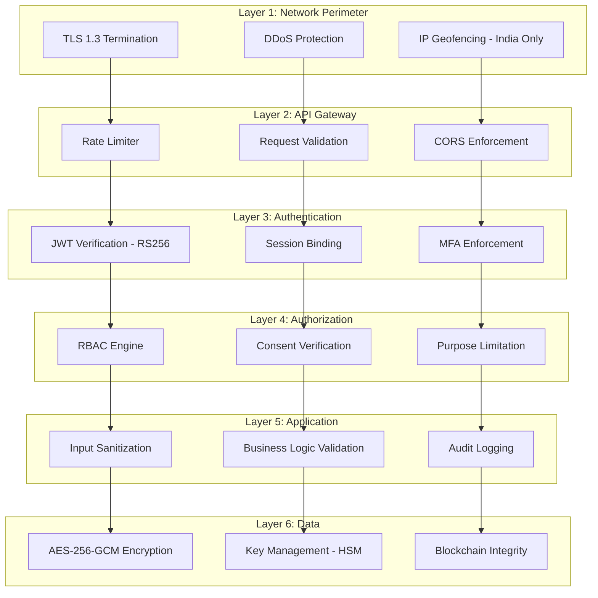

### 1.2 Security Principles

| Principle | Implementation |
|-----------|---------------|
| Zero Trust | Every request verified regardless of origin |
| Least Privilege | Role-based access with minimum necessary permissions |
| Defense in Depth | Six security layers, each independently enforceable |
| Encryption by Default | All PII encrypted at rest (AES-256-GCM) and in transit (TLS 1.3) |
| Audit Everything | Every action produces an immutable, blockchain-anchored log |
| Fail Secure | Errors default to deny access, never expose data |
| Separation of Concerns | Keys separate from data, auth separate from business logic |

---

## 2. Threat Model

### 2.1 STRIDE Analysis

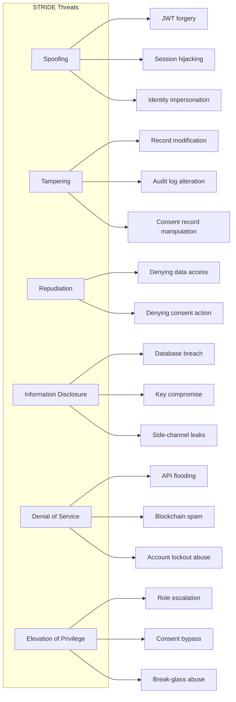

### 2.2 Threat Catalog

| ID | Threat | Category | Likelihood | Impact | Risk | Mitigation |
|----|--------|----------|-----------|--------|------|------------|
| T-01 | JWT token theft via XSS | Spoofing | Medium | High | High | HttpOnly cookies, CSP headers, input sanitization |
| T-02 | Session fixation attack | Spoofing | Low | High | Medium | Regenerate session on auth, bind to IP/UA |
| T-03 | Brute force login | Spoofing | High | Medium | High | Account lockout (5 attempts/15 min), rate limiting |
| T-04 | Database breach (MongoDB) | Info Disclosure | Medium | Critical | Critical | AES-256-GCM field encryption, separate key store |
| T-05 | Unauthorized record modification | Tampering | Medium | High | High | Blockchain verification hashes, version history |
| T-06 | Audit log tampering | Tampering | Low | Critical | High | Hash chain + blockchain anchoring, append-only |
| T-07 | Consent record manipulation | Tampering | Low | Critical | High | Blockchain-anchored consent hashes |
| T-08 | Smart contract exploitation | Elevation | Low | High | Medium | Contract auditing, access modifiers, Ganache isolation |
| T-09 | Chameleon hash key compromise | Info Disclosure | Low | Critical | High | HSM storage, multi-party access, rotation |
| T-10 | Insider threat (privileged user) | Elevation | Medium | Critical | Critical | MFA for sensitive ops, dual authorization, full audit |
| T-11 | DDoS on API endpoints | DoS | High | Medium | High | Rate limiting, IP blocking, graduated throttling |
| T-12 | Consent bypass via direct DB access | Elevation | Low | Critical | High | Network isolation, DB auth, encrypted fields |
| T-13 | Break-glass access abuse | Elevation | Medium | High | High | Mandatory justification, time limit, DPO notification |
| T-14 | Cross-border data exfiltration | Info Disclosure | Low | Critical | High | Data residency controls, egress monitoring |
| T-15 | Encryption key loss | DoS | Low | Critical | High | Shamir's Secret Sharing (3-of-5), HSM backup |

### 2.3 Insider Threat Mitigation

| Insider Role | Threat Scenario | Controls |
|--------------|-----------------|----------|
| Doctor | Access patient records without consent | Consent verification on every access, full audit trail |
| Doctor | Abuse break-glass for non-emergencies | Mandatory justification, DPO review, time-limited access |
| Pharmacy Staff | Access data beyond prescriptions/allergies | Purpose limitation (category restriction), audit logging |
| Admin | Modify system configuration maliciously | Dual authorization for critical changes, blockchain proof |
| DPO | Unauthorized redaction operations | MFA + multi-party approval, cryptographic proof of authorization |
| Database Admin | Direct database manipulation | Field-level encryption (data unreadable without keys), integrity verification detects changes |

---

## 3. Authentication Design

### 3.1 JWT Architecture

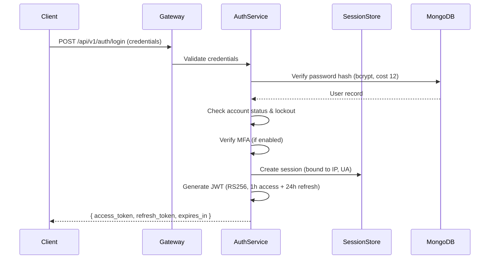

**JWT Token Structure (Access Token)**:
```
Header: { "alg": "RS256", "typ": "JWT", "kid": "key-rotation-id" }
Payload: {
  "sub": "user-uuid",
  "role": "patient|doctor|pharmacy_staff|admin|dpo",
  "org_id": "organization-uuid",
  "session_id": "session-uuid-hash",
  "iat": 1718000000,
  "exp": 1718003600,
  "iss": "dpdp-healthcare-platform",
  "aud": "dpdp-healthcare-api"
}
```

### 3.2 Token Lifecycle

| Token Type | Validity | Storage | Rotation |
|------------|----------|---------|----------|
| Access Token | 1 hour | Memory (client-side) | On expiry via refresh |
| Refresh Token | 24 hours | HttpOnly secure cookie | Single-use (rotated on each use) |
| MFA Token | 5 minutes | Server-side only | Single-use |

**Refresh Token Rotation**:
- Each refresh token is single-use; using it issues a new access + refresh pair
- If a refresh token is reused (replay attack), all sessions for that user are invalidated
- Refresh tokens are bound to session ID and cannot cross sessions

### 3.3 Session Management

| Parameter | Patient | Doctor | Pharmacy Staff | Admin | DPO |
|-----------|---------|--------|----------------|-------|-----|
| Idle Timeout | 30 min | 15 min | 15 min | 15 min | 15 min |
| Max Session Duration | 8 hours | 12 hours | 8 hours | 4 hours | 8 hours |
| Concurrent Sessions | 3 | 2 | 2 | 1 | 2 |
| Session Binding | IP range + UA | IP + UA | IP + UA | Exact IP + UA | Exact IP + UA |

**Session Security Controls**:
- Session token: 256-bit cryptographically random value
- Binding: Session locked to originating IP range (/24) and user-agent fingerprint
- Fixation protection: New session ID generated on every privilege change
- Suspicious activity triggers: Geographic IP change, concurrent limit exceeded → force logout all sessions

### 3.4 Account Lockout

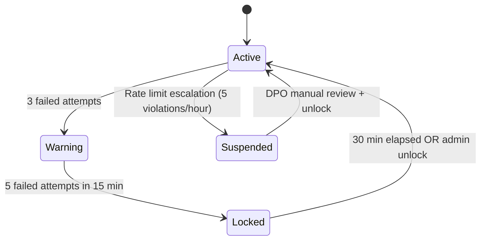

---

## 4. Authorization Design

### 4.1 RBAC Model

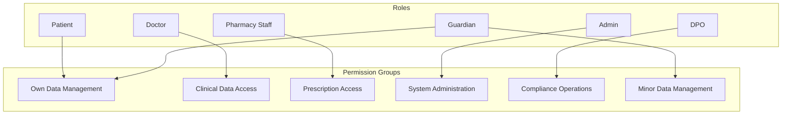

### 4.2 Permission Matrix

| Resource | Patient | Doctor | Pharmacy | Admin | DPO |
|----------|---------|--------|----------|-------|-----|
| Own profile (read) | ✅ | ✅ | ✅ | ✅ | ✅ |
| Own profile (write) | ✅ | ✅ | ✅ | ❌ | ❌ |
| Patient health records (read) | Own only | Consent required | ❌ | ❌ | Audit only |
| Patient health records (write) | Corrections | Create/update | ❌ | ❌ | ❌ |
| Prescriptions (read) | Own only | Own patients | Consent required | ❌ | Audit only |
| Prescriptions (write) | ❌ | Create | Dispense only | ❌ | ❌ |
| Lab reports (read) | Own only | Consent required | ❌ | ❌ | Audit only |
| Consents (read) | Own only | ❌ | ❌ | ❌ | All (stats) |
| Consents (write) | Own only | ❌ | ❌ | ❌ | ❌ |
| Audit logs (read) | Own data | Own actions | Own actions | System logs | All |
| Blockchain verify | Own records | Own patients | ❌ | System | All |
| Chameleon hash authorize | ❌ | ❌ | ❌ | ✅ (with DPO) | ✅ |
| User management | ❌ | ❌ | ❌ | ✅ | ❌ |
| Breach management | ❌ | ❌ | ❌ | ❌ | ✅ |
| Grievance handling | Submit own | ❌ | ❌ | ❌ | Manage all |
| Break-glass access | ❌ | ✅ | ❌ | ❌ | Review |
| Processor management | ❌ | ❌ | ❌ | ❌ | ✅ |
| System backup | ❌ | ❌ | ❌ | ✅ | ✅ |

### 4.3 Consent-Augmented Access Control

Standard RBAC is augmented with consent verification:

```
Access Decision = RBAC_Permission AND Consent_Check AND Purpose_Match

Where:
- RBAC_Permission: Role has base permission for resource type
- Consent_Check: Patient has active consent for the access purpose
- Purpose_Match: Requested data categories fall within consent scope
```

**Exception**: Break-glass access bypasses consent check (but not RBAC) with mandatory justification and DPO notification.

---

## 5. AES-256 Encryption Architecture

### 5.1 Encryption Flow

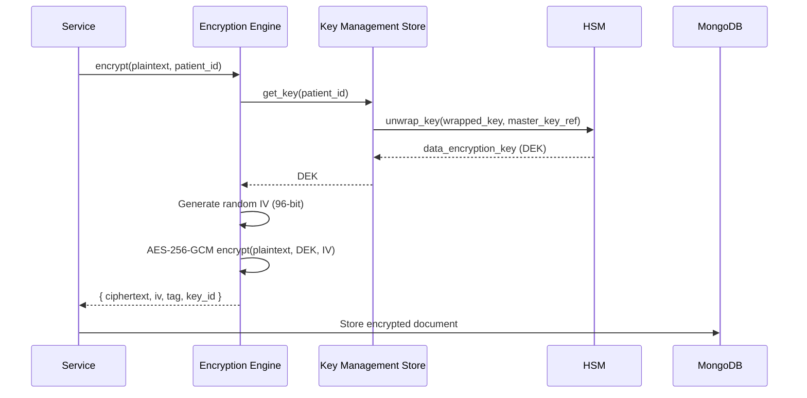

### 5.2 Key Hierarchy

```
┌─────────────────────────────────────────────┐
│  Master Key (MK)                             │
│  Storage: HSM (never leaves hardware)        │
│  Purpose: Wraps/unwraps all KEKs             │
│  Rotation: Annual                            │
├─────────────────────────────────────────────┤
│  Key Encryption Keys (KEKs)                  │
│  Storage: Key Store (encrypted by MK)        │
│  Purpose: Wraps/unwraps DEKs                 │
│  Rotation: Every 6 months                    │
├─────────────────────────────────────────────┤
│  Data Encryption Keys (DEKs)                 │
│  Storage: Key Store (wrapped by KEK)         │
│  Scope: One per Data_Principal               │
│  Purpose: Encrypts patient data fields       │
│  Rotation: Every 90 days                     │
├─────────────────────────────────────────────┤
│  System Keys                                 │
│  - Chameleon Hash trapdoor key (sk)          │
│  - Audit log signing key                     │
│  - JWT signing key pair (RS256)              │
│  Storage: HSM + Key Store                    │
│  Rotation: Per policy                        │
└─────────────────────────────────────────────┘
```

### 5.3 Key Rotation Process

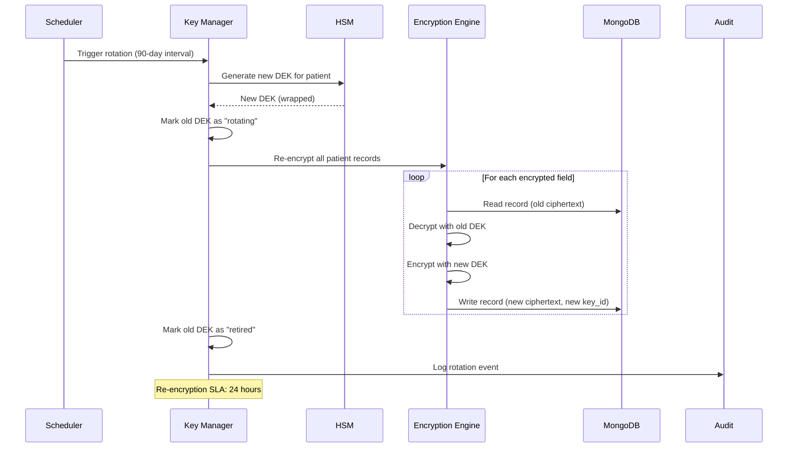

### 5.4 Key Backup and Recovery (Shamir's Secret Sharing)

```
Master Key Backup:
┌─────────────────────────────────────────────────┐
│  Shamir's Secret Sharing (3-of-5 threshold)      │
│                                                   │
│  Master Key → Split into 5 shares               │
│                                                   │
│  Share 1 → Custodian A (DPO)                    │
│  Share 2 → Custodian B (Admin)                  │
│  Share 3 → Custodian C (External Auditor)       │
│  Share 4 → Custodian D (Legal Counsel)          │
│  Share 5 → Custodian E (Board Member)           │
│                                                   │
│  Recovery: Any 3 custodians can reconstruct MK   │
│  Authorization: DPO + Admin must both participate │
│  Time limit: Recovery completes within 2 hours   │
└─────────────────────────────────────────────────┘
```

**Recovery Trigger Conditions**:
- HSM hardware failure
- Master key corruption detected
- Disaster recovery activation
- Compliance audit requirement

---

## 6. Data Protection Strategy

### 6.1 Encryption at Rest

| Data Location | Encryption Method | Key Scope |
|---------------|-------------------|-----------|
| MongoDB patient fields | AES-256-GCM (field-level) | Per-patient DEK |
| MongoDB system fields | Unencrypted (non-sensitive metadata) | N/A |
| Key Store | AES-256 wrapped by HSM master key | Per-key wrapping |
| Blockchain backups | AES-256-GCM | System backup key |
| File attachments | AES-256-GCM | Per-patient DEK |
| Session tokens | SHA-256 hash (stored) | N/A |

### 6.2 Encryption in Transit

| Channel | Protocol | Configuration |
|---------|----------|---------------|
| Client ↔ Server | TLS 1.3 | ECDHE key exchange, AES-256-GCM cipher suite |
| Server ↔ MongoDB | TLS 1.2+ | X.509 mutual authentication |
| Server ↔ Key Store | mTLS | Client certificate authentication |
| Server ↔ Ganache | HTTP (local only) | Network-isolated, no external exposure |
| Server ↔ HSM | PKCS#11 | Hardware-bound channel |

### 6.3 Data Minimization Enforcement

| Consent Purpose | Allowed Data Categories | Blocked Categories |
|-----------------|------------------------|-------------------|
| Healthcare Treatment | medical_history, allergies, prescriptions, lab_reports | contact_info, identity_info |
| Pharmacy Access | prescriptions, allergies | medical_history, lab_reports, contact_info |
| Research Access | anonymized_medical_history, anonymized_lab_reports | All PII |
| Insurance Access | medical_history, prescriptions | lab_reports, contact_info |
| Analytics Access | Aggregated statistics only | All individual records |
| Marketing Access | contact_info only | All health data |

---

## 7. API Security

### 7.1 Rate Limiting Architecture

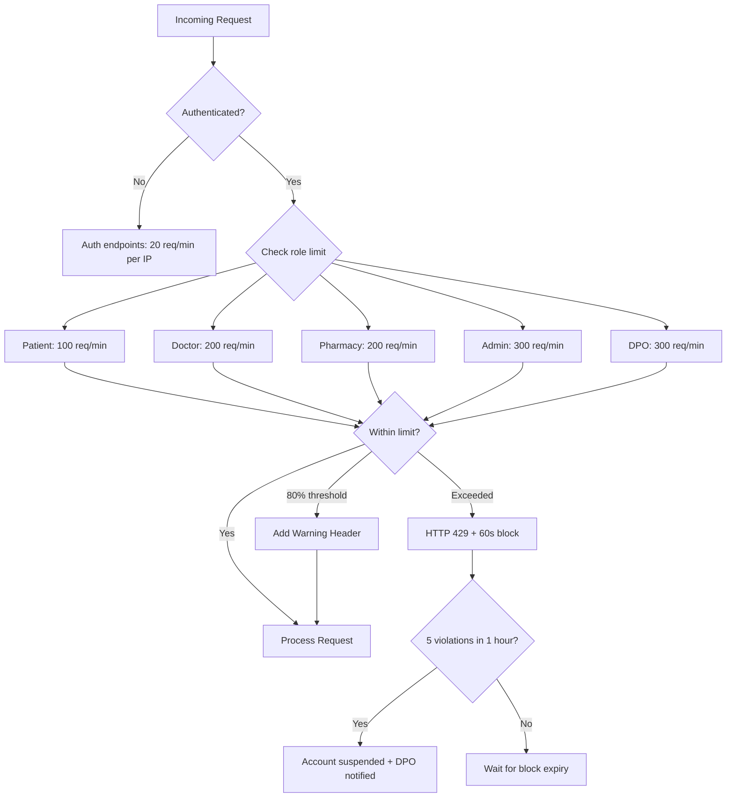

**Rate Limit Response Headers**:
```
X-RateLimit-Limit: 100
X-RateLimit-Remaining: 73
X-RateLimit-Reset: 1718003600
X-RateLimit-Warning: approaching-limit  (when >80%)
```

### 7.2 Input Validation

| Attack Vector | Validation | Implementation |
|---------------|-----------|----------------|
| SQL/NoSQL Injection | Parameterized queries, schema validation | PyMongo parameterized ops, Marshmallow schemas |
| XSS | Output encoding, CSP headers | React auto-escaping, strict CSP |
| Path Traversal | Whitelist allowed paths | Path canonicalization, no user-controlled file paths |
| Mass Assignment | Explicit field whitelisting | Schema-defined allowed fields per endpoint |
| Buffer Overflow | Input length limits | Max field lengths enforced at schema level |
| Unicode attacks | Normalize before validation | NFKC normalization on text inputs |

### 7.3 Security Headers

```
Content-Security-Policy: default-src 'self'; script-src 'self'; style-src 'self' 'unsafe-inline'
X-Content-Type-Options: nosniff
X-Frame-Options: DENY
X-XSS-Protection: 0 (rely on CSP instead)
Strict-Transport-Security: max-age=31536000; includeSubDomains
Referrer-Policy: strict-origin-when-cross-origin
Permissions-Policy: camera=(), microphone=(), geolocation=()
```

### 7.4 CSRF Protection

- SameSite=Strict on all cookies
- Custom header requirement (`X-Requested-With`) for state-changing requests
- Double-submit cookie pattern for form submissions
- Refresh tokens stored in HttpOnly, Secure, SameSite=Strict cookies

---

## 8. Audit and Monitoring

### 8.1 Security Event Classification

| Event Category | Examples | Severity | Response |
|----------------|----------|----------|----------|
| Authentication Failure | Failed login, MFA failure | Warning (single), Critical (pattern) | Log, lockout after threshold |
| Authorization Violation | RBAC denial, consent check failure | High | Log, alert DPO if repeated |
| Integrity Violation | Hash mismatch, audit log tampering | Critical | Immediate DPO alert, auto-investigation |
| Rate Limit Breach | Threshold exceeded, DDoS pattern | Medium-High | Block, escalate if persistent |
| Session Anomaly | IP change, concurrent limit, fixation | High | Force logout, require MFA |
| Data Exfiltration Pattern | Bulk download, unusual access volume | Critical | Suspend account, DPO alert |
| Chameleon Hash Operation | Collision generation triggered | Info (authorized), Critical (unauthorized) | Full audit trail |
| Break-Glass Invocation | Emergency access activated | High | DPO notification within 30s |

### 8.2 SIEM Integration Design

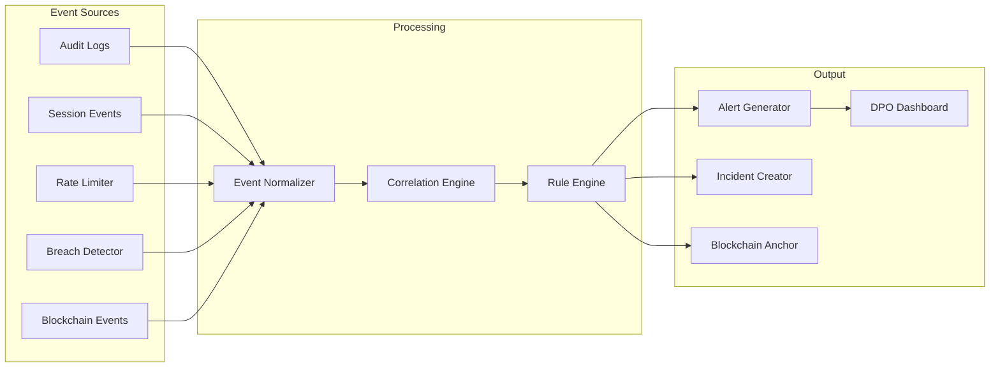

### 8.3 Breach Detection Rules

| Rule ID | Name | Trigger Condition | Action |
|---------|------|-------------------|--------|
| BR-001 | Unrecognized IP | Access from IP not in user's history | Alert (medium) |
| BR-002 | Geo-anomaly | IP geolocation outside India | Block + critical alert |
| BR-003 | Off-hours access | Clinical role access outside authorized hours | Alert (high) |
| BR-004 | Consent scope violation | Access to categories not in active consent | Block + alert DPO |
| BR-005 | Volume anomaly | >50 record accesses in 1 minute | Rate limit + investigate |
| BR-006 | Bulk export pattern | >5 export requests in 10 minutes | Block + DPO alert |
| BR-007 | Privilege escalation attempt | Request for resources above role level | Block + log + alert |
| BR-008 | Session replay | Reuse of expired/invalidated session token | Block + force logout all |
| BR-009 | Concurrent session flood | Sessions exceeding role limit | Terminate oldest, alert |
| BR-010 | Audit log integrity | Hash chain broken or hash mismatch | Critical alert, auto-investigation |

---

## 9. Incident Response Design

### 9.1 Incident Response Workflow

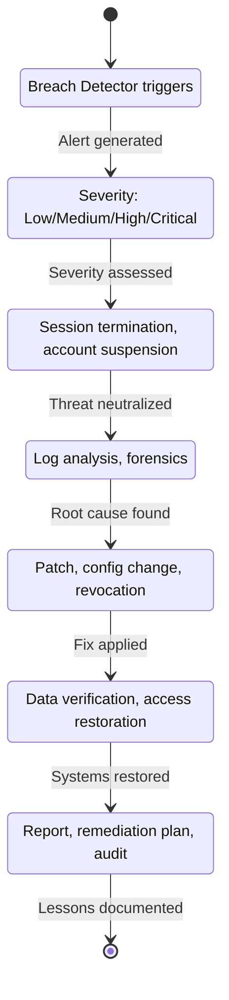

### 9.2 Notification Timeline (DPDP Compliance)

| Event | DPO Notification | Patient Notification | Regulatory (if required) |
|-------|-----------------|---------------------|--------------------------|
| Breach detected | ≤ 30 seconds | ≤ 60 seconds (summary) | Within 72 hours |
| Break-glass invoked | ≤ 30 seconds | ≤ 60 seconds | N/A |
| Integrity violation | ≤ 30 seconds | Immediate | If data compromised |
| Consent scope violation | ≤ 60 seconds | ≤ 60 seconds | N/A |
| Account compromise | Immediate | Immediate | If mass breach |

### 9.3 Containment Actions (Automated)

| Trigger | Automated Response | Manual Follow-up |
|---------|-------------------|-----------------|
| Confirmed unauthorized access | Terminate all user sessions, suspend account | DPO review for reactivation |
| Integrity violation detected | Quarantine affected records, block access | DPO investigation, restore from verified state |
| Rate limit escalation | Suspend API access | DPO review account |
| Session hijack detected | Invalidate all sessions, require MFA re-enrollment | Security team investigation |
| Chameleon key anomaly | Lock all redaction operations | Multi-party key verification |

---

## 10. Compliance Security Controls

### 10.1 DPDP Act Security Alignment

| DPDP Requirement | Security Control | Verification Method |
|------------------|------------------|---------------------|
| Reasonable security safeguards | AES-256-GCM encryption, RBAC, audit logging | Automated integrity checks |
| Prevent unauthorized access | JWT + session binding + MFA + consent checks | Access log analysis |
| Breach notification (72h) | Automated detection + notification pipeline | SLA monitoring |
| Data minimization | Purpose-limited data access via consent scope | Access pattern audit |
| Processing only with consent | Consent verification on every data access | Blockchain-anchored consent proof |
| Right to erasure | Chameleon hash redaction with blockchain proof | Redaction verification |
| Accountability | Immutable audit trail (8-year retention) | Blockchain integrity verification |
| Cross-border restriction | Data residency enforcement, egress blocking | Monthly compliance scans |

### 10.2 Healthcare Security Controls

| Control | Standard Reference | Implementation |
|---------|-------------------|----------------|
| Patient data confidentiality | Healthcare data governance | Field-level encryption (per-patient key) |
| Clinical record integrity | Medical record standards | Blockchain hash verification |
| Emergency access | Clinical necessity | Break-glass with time limit, justification, audit |
| Prescription security | Pharmacy regulations | Consent-gated access, dispensing audit trail |
| Minors' data protection | DPDP Section 9 | Guardian consent, enhanced minimization |
| Record retention | Healthcare regulations (8 years) | Tiered storage with retention enforcement |
| Audit trail | Compliance requirement | Append-only, hash-chained, blockchain-anchored |

---

## 11. Security Architecture Diagrams

### 11.1 Authentication and Session Flow

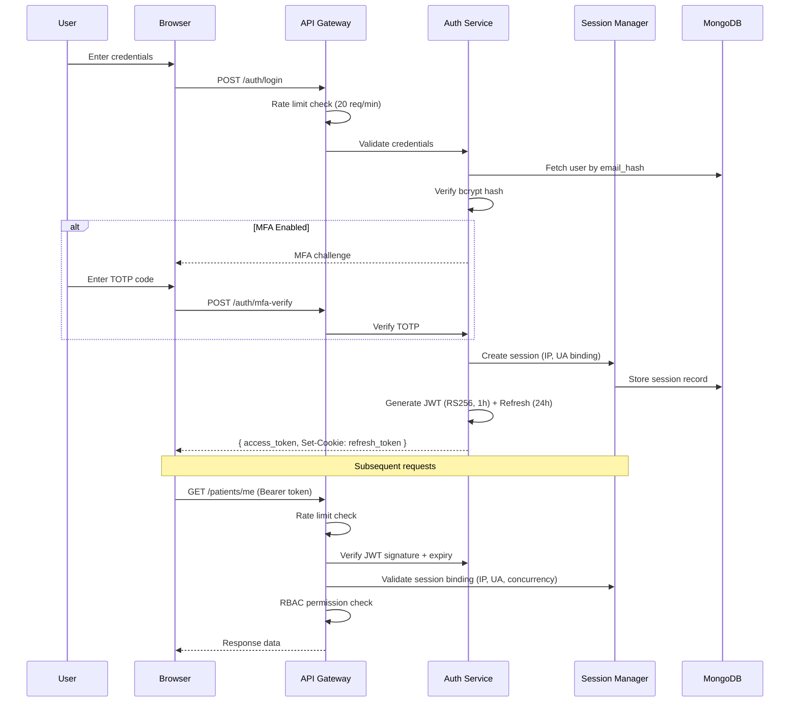

### 11.2 Encryption and Key Management Flow

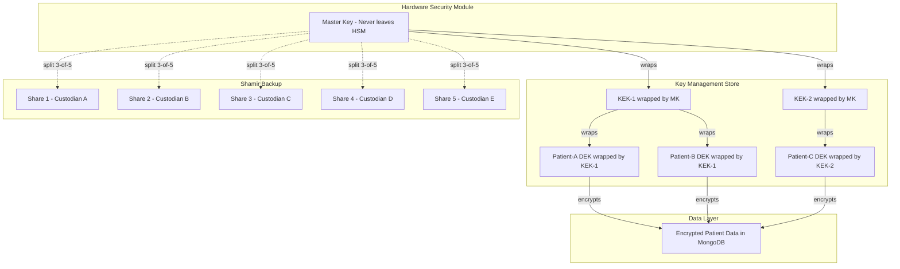

### 11.3 Consent-Gated Data Access

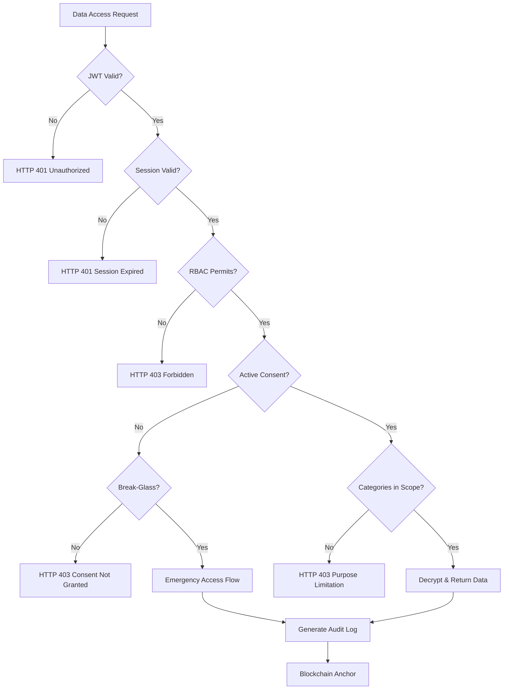

---

## 12. Security Gap Analysis

### 12.1 Current Coverage Assessment

| Security Domain | Coverage | Gaps | Risk Level |
|-----------------|----------|------|------------|
| Authentication | 95% | Hardware token MFA not specified (TOTP only) | Low |
| Authorization | 95% | Attribute-based access control (ABAC) not implemented | Low |
| Encryption at Rest | 98% | Metadata fields unencrypted (by design for querying) | Accepted |
| Encryption in Transit | 100% | — | — |
| Key Management | 92% | HSM failover procedure not detailed | Medium |
| Session Security | 95% | WebSocket session binding not addressed | Low |
| API Security | 93% | API versioning deprecation security not specified | Low |
| Breach Detection | 90% | ML-based anomaly detection out of scope | Accepted |
| Incident Response | 90% | Automated forensic capture not detailed | Medium |
| Blockchain Security | 88% | Ganache single-node is not production Ethereum | Accepted (academic) |
| Compliance | 95% | DPIA formal process not automated | Low |

### 12.2 Accepted Risks

| Risk | Reason for Acceptance | Compensating Control |
|------|----------------------|---------------------|
| Ganache is not production Ethereum | Academic project scope | Backup/recovery, integrity verification |
| No ML-based anomaly detection | Complexity vs. academic scope | Rule-based detection covers primary threats |
| Metadata fields unencrypted | Required for MongoDB queries | No PII in metadata, only UUIDs and timestamps |
| Single HSM (no failover) | Cost constraint | Shamir backup enables recovery |

### 12.3 Security Maturity Scores

| Domain | Score | Target | Gap |
|--------|-------|--------|-----|
| Identity & Access Management | 90/100 | 95 | Hardware MFA |
| Data Protection | 95/100 | 95 | Met |
| Network Security | 85/100 | 90 | WAF not specified |
| Application Security | 92/100 | 95 | Penetration testing schedule |
| Monitoring & Detection | 88/100 | 90 | SIEM tooling selection |
| Incident Response | 87/100 | 90 | Automated forensics |
| Compliance | 93/100 | 95 | DPIA automation |
| **Overall** | **90/100** | **93** | **3-point gap** |
