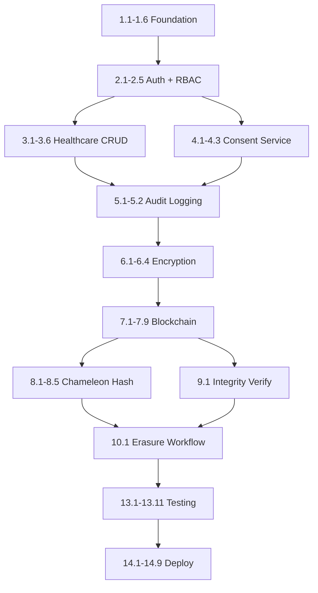

# Implementation Task List

## DPDP Compliant Redactable Blockchain Based Healthcare and Pharmacy Management System

---

## Priority Legend

| Priority | Meaning | MVP? |
|----------|---------|------|
| 🔴 Critical | System cannot function without this | Yes |
| 🟠 Important | Required for DPDP compliance and core workflow | Yes |
| 🟡 Optional | Enhances quality but system works without it | No |
| 🔵 Research | Novel contribution, demo differentiator | No (but high impact for evaluation) |

---

## Summary

| Priority | Task Count | Total Hours |
|----------|-----------|-------------|
| 🔴 Critical | 42 | ~168h |
| 🟠 Important | 35 | ~140h |
| 🟡 Optional | 18 | ~72h |
| 🔵 Research | 8 | ~40h |
| **Total** | **103** | **~420h** |

---

## Phase 1: Foundation Setup

| # | Task | Priority | Hours | Owner | Dependencies |
|---|------|----------|-------|-------|--------------|
| 1.1 | Initialize Flask project with app factory pattern, config, extensions | 🔴 Critical | 3h | Dev A | None |
| 1.2 | Initialize React + Vite + TypeScript + Tailwind CSS project | 🔴 Critical | 3h | Dev B | None |
| 1.3 | Configure Shadcn UI components + design tokens (colors, typography) | 🔴 Critical | 4h | Dev B | 1.2 |
| 1.4 | Docker Compose setup (MongoDB, Ganache, Flask, React) | 🔴 Critical | 4h | Dev A | 1.1 |
| 1.5 | MongoDB connection + initialize all 18 collections with indexes | 🔴 Critical | 4h | Dev A | 1.4 |
| 1.6 | Create base models (User, Patient, Doctor, PharmacyStaff, Organization) | 🔴 Critical | 4h | Dev A | 1.5 |
| 1.7 | API error handling framework (standardized error responses) | 🟠 Important | 2h | Dev A | 1.1 |
| 1.8 | Frontend API service layer (Axios instance, interceptors) | 🔴 Critical | 2h | Dev B | 1.2 |
| 1.9 | Environment configuration (.env templates, secrets structure) | 🟠 Important | 2h | Dev A | 1.4 |

---

## Phase 2: Authentication & RBAC

| # | Task | Priority | Hours | Owner | Dependencies |
|---|------|----------|-------|-------|--------------|
| 2.1 | User registration endpoint (bcrypt hash, UUID generation, deny-all defaults) | 🔴 Critical | 4h | Dev A | 1.6 |
| 2.2 | Login endpoint (credential validation, JWT RS256 issuance) | 🔴 Critical | 4h | Dev A | 2.1 |
| 2.3 | JWT middleware (signature verification, expiry check, claims extraction) | 🔴 Critical | 3h | Dev A | 2.2 |
| 2.4 | Refresh token mechanism (single-use rotation, HttpOnly cookie) | 🟠 Important | 3h | Dev A | 2.2 |
| 2.5 | RBAC middleware (5 roles × resource permission matrix) | 🔴 Critical | 4h | Dev A | 2.3 |
| 2.6 | Session management service (IP/UA binding, idle timeout, concurrency) | 🟠 Important | 5h | Dev A | 2.3 |
| 2.7 | Account lockout logic (5 attempts/15 min, 30 min lock) | 🟠 Important | 2h | Dev A | 2.2 |
| 2.8 | Rate limiting middleware (token bucket, role-based limits) | 🟠 Important | 4h | Dev A | 2.3 |
| 2.9 | Login page UI (email, password, error states) | 🔴 Critical | 3h | Dev B | 1.3 |
| 2.10 | Registration page UI (form validation, age verification) | 🔴 Critical | 4h | Dev B | 1.3 |
| 2.11 | Auth context (React Context, token storage, auto-refresh) | 🔴 Critical | 3h | Dev B | 1.8 |
| 2.12 | Protected route wrapper + role-based route guards | 🔴 Critical | 2h | Dev B | 2.11 |
| 2.13 | App shell layout (sidebar, header, footer, role-based navigation) | 🔴 Critical | 5h | Dev B | 2.12 |
| 2.14 | MFA implementation (TOTP generation and verification) | 🟡 Optional | 5h | Dev A | 2.2 |

---

## Phase 3: Healthcare Data Management

| # | Task | Priority | Hours | Owner | Dependencies |
|---|------|----------|-------|-------|--------------|
| 3.1 | Patient profile CRUD endpoints (create, read, update) | 🔴 Critical | 5h | Dev A | 2.5 |
| 3.2 | Healthcare records CRUD (consultation create, list, detail) | 🔴 Critical | 5h | Dev A | 3.1 |
| 3.3 | Prescriptions CRUD (create by doctor, dispense by pharmacy) | 🔴 Critical | 5h | Dev A | 3.1 |
| 3.4 | Lab reports CRUD (create, review, attach to consultation) | 🟠 Important | 4h | Dev A | 3.2 |
| 3.5 | Doctor workflow: consent-gated patient access | 🔴 Critical | 4h | Dev A | 3.2, 4.1 |
| 3.6 | Pharmacy workflow: consent-gated prescription access + dispensing | 🔴 Critical | 4h | Dev A | 3.3, 4.1 |
| 3.7 | Break-glass access endpoint (justification, time-limit, DPO notify) | 🟠 Important | 4h | Dev A | 3.5 |
| 3.8 | Patient Dashboard UI (profile summary, health summary, widgets) | 🔴 Critical | 6h | Dev B | 2.13 |
| 3.9 | Personal Data Center UI (categorized view, edit, download) | 🔴 Critical | 6h | Dev B | 3.8 |
| 3.10 | Doctor Dashboard + patient search UI | 🔴 Critical | 5h | Dev B | 2.13 |
| 3.11 | Consultation form UI (create consultation record) | 🟠 Important | 4h | Dev B | 3.10 |
| 3.12 | Pharmacy Dashboard + dispensing workflow UI | 🟠 Important | 4h | Dev B | 2.13 |
| 3.13 | Break-glass access UI (justification form, emergency flow) | 🟠 Important | 3h | Dev B | 3.10 |
| 3.14 | Data download endpoint (JSON export within 30s) | 🟠 Important | 3h | Dev A | 3.1 |

---

## Phase 4: Consent Management

| # | Task | Priority | Hours | Owner | Dependencies |
|---|------|----------|-------|-------|--------------|
| 4.1 | Consent service (grant, modify, withdraw logic) | 🔴 Critical | 6h | Dev A | 3.1 |
| 4.2 | Consent enforcement (pre-access check, category scoping) | 🔴 Critical | 4h | Dev A | 4.1 |
| 4.3 | Purpose limitation enforcement (category × purpose matrix) | 🔴 Critical | 3h | Dev A | 4.2 |
| 4.4 | Consent expiry scheduler (auto-revoke, 7-day warning) | 🟠 Important | 3h | Dev A | 4.1 |
| 4.5 | Consent receipt generation (UUID, hash, PDF with QR) | 🟠 Important | 4h | Dev A | 4.1 |
| 4.6 | Consent Management Center UI (6 consent type cards) | 🔴 Critical | 5h | Dev B | 3.8 |
| 4.7 | Grant consent dialog (purpose display, scope selection, confirm) | 🔴 Critical | 3h | Dev B | 4.6 |
| 4.8 | Withdraw consent confirmation dialog (destructive action UX) | 🔴 Critical | 2h | Dev B | 4.6 |
| 4.9 | Active Data Sharing Dashboard UI (entity cards, revoke buttons) | 🟠 Important | 4h | Dev B | 4.6 |
| 4.10 | Consent receipt download UI (PDF viewer, QR display) | 🟡 Optional | 3h | Dev B | 4.5 |

---

## Phase 5: Audit Logging

| # | Task | Priority | Hours | Owner | Dependencies |
|---|------|----------|-------|-------|--------------|
| 5.1 | Audit service (log generation for every CRUD operation) | 🔴 Critical | 5h | Dev A | 2.5 |
| 5.2 | Audit middleware (auto-capture pre/post request) | 🔴 Critical | 3h | Dev A | 5.1 |
| 5.3 | Hash chain implementation (previous_log_hash linking) | 🟠 Important | 3h | Dev A | 5.1 |
| 5.4 | Data access log materialization (patient-facing timeline data) | 🟠 Important | 3h | Dev A | 5.1 |
| 5.5 | Audit log search/filter API (actor, type, date, category) | 🟠 Important | 3h | Dev A | 5.1 |
| 5.6 | Data Usage Timeline UI (vertical timeline, color-coded cards) | 🔴 Critical | 5h | Dev B | 3.8 |
| 5.7 | Timeline filters (date range, accessor role, category, type) | 🟠 Important | 3h | Dev B | 5.6 |
| 5.8 | Audit Log Viewer UI (searchable DataTable, pagination) | 🟠 Important | 4h | Dev B | 2.13 |
| 5.9 | DPO audit monitoring view (aggregate stats, critical events) | 🟡 Optional | 4h | Dev B | 5.8 |

---

## Phase 6: AES Encryption Layer

| # | Task | Priority | Hours | Owner | Dependencies |
|---|------|----------|-------|-------|--------------|
| 6.1 | Encryption service (AES-256-GCM encrypt/decrypt, IV generation) | 🔴 Critical | 5h | Dev A | 1.6 |
| 6.2 | Per-patient key generation (on registration) | 🔴 Critical | 3h | Dev A | 6.1 |
| 6.3 | Key management store (separate from data DB) | 🔴 Critical | 4h | Dev A | 6.2 |
| 6.4 | Repository-level transparent encryption (encrypt on write, decrypt on read) | 🔴 Critical | 6h | Dev A | 6.1, 6.3 |
| 6.5 | Migrate existing patient data to encrypted format | 🟠 Important | 3h | Dev A | 6.4 |
| 6.6 | Key rotation service (90-day cycle, re-encrypt records) | 🟠 Important | 5h | Dev A | 6.3 |
| 6.7 | Decryption failure handling (log, deny, alert DPO) | 🟠 Important | 2h | Dev A | 6.4 |
| 6.8 | Encryption status indicators in UI (🔒 icons on fields) | 🟡 Optional | 2h | Dev B | 3.9 |

---

## Phase 7: Blockchain Integration

| # | Task | Priority | Hours | Owner | Dependencies |
|---|------|----------|-------|-------|--------------|
| 7.1 | ConsentContract.sol (storeConsent, withdrawConsent, verify, events) | 🔴 Critical | 6h | Dev A | 1.4 |
| 7.2 | VerificationContract.sol (storeHash, updateHash, verify, batch, redactionProof) | 🔴 Critical | 6h | Dev A | 7.1 |
| 7.3 | AuditContract.sol (storeAuditHash, verifyChain, events) | 🔴 Critical | 5h | Dev A | 7.1 |
| 7.4 | Contract deployment script (deploy.py, save ABI + addresses) | 🔴 Critical | 3h | Dev A | 7.1-7.3 |
| 7.5 | Blockchain service (Web3.py, transaction building, signing, receipt handling) | 🔴 Critical | 5h | Dev A | 7.4 |
| 7.6 | Consent hash anchoring (auto-anchor on grant/modify/withdraw) | 🔴 Critical | 3h | Dev A | 7.5, 4.1 |
| 7.7 | Record hash anchoring (auto-anchor on create/update) | 🔴 Critical | 3h | Dev A | 7.5 |
| 7.8 | Audit hash anchoring (auto-anchor on log creation) | 🟠 Important | 3h | Dev A | 7.5, 5.1 |
| 7.9 | Blockchain anchor repository (store tx references in MongoDB) | 🔴 Critical | 2h | Dev A | 7.5 |
| 7.10 | Blockchain Explorer UI (transaction list, status, search) | 🟠 Important | 4h | Dev B | 7.5 |
| 7.11 | Transaction reference component (clickable hash, block number) | 🟠 Important | 2h | Dev B | 7.10 |

---

## Phase 8: Chameleon Hashing Integration

| # | Task | Priority | Hours | Owner | Dependencies |
|---|------|----------|-------|-------|--------------|
| 8.1 | Chameleon hash engine: parameter generation (p, g, x, y) | 🔵 Research | 5h | Dev A | None |
| 8.2 | Chameleon hash computation: CH(m,r) = g^m · y^r mod p | 🔵 Research | 5h | Dev A | 8.1 |
| 8.3 | Collision generation: compute r' using trapdoor key x | 🔵 Research | 6h | Dev A | 8.2 |
| 8.4 | Data correction workflow (update record + generate collision) | 🔵 Research | 5h | Dev A | 8.3, 6.4 |
| 8.5 | Data erasure workflow (redact fields + generate collision + blockchain proof) | 🔵 Research | 6h | Dev A | 8.3, 7.5 |
| 8.6 | Version history service (store previous values, encrypted archive) | 🟠 Important | 4h | Dev A | 8.4 |
| 8.7 | Chameleon Hash visualization UI (traditional vs CH comparison) | 🔵 Research | 4h | Dev B | 7.10 |
| 8.8 | DPO redaction authorization UI (MFA, legal basis, approve flow) | 🟠 Important | 4h | Dev B | 8.5 |
| 8.9 | Version history UI (field-level diffs, timeline) | 🟠 Important | 4h | Dev B | 8.6 |
| 8.10 | Redaction proof display (blockchain anchor + CH value) | 🔵 Research | 3h | Dev B | 8.5 |

---

## Phase 9: Integrity Verification

| # | Task | Priority | Hours | Owner | Dependencies |
|---|------|----------|-------|-------|--------------|
| 9.1 | Integrity service (single record verify: compute hash, compare with blockchain) | 🔴 Critical | 4h | Dev A | 7.5 |
| 9.2 | Batch verification (verify all patient records simultaneously) | 🟠 Important | 3h | Dev A | 9.1 |
| 9.3 | Tamper detection logic (mismatch → alert DPO within 30s) | 🟠 Important | 3h | Dev A | 9.1 |
| 9.4 | Scheduled batch verification (daily background job) | 🟡 Optional | 2h | Dev A | 9.2 |
| 9.5 | Integrity Verification screen UI (record list, verify buttons, status badges) | 🔴 Critical | 5h | Dev B | 9.1 |
| 9.6 | Verified/Violation badges (green ✅ / red 🔴 indicators) | 🔴 Critical | 2h | Dev B | 9.5 |
| 9.7 | Batch verify progress indicator | 🟡 Optional | 2h | Dev B | 9.2 |
| 9.8 | How-it-works educational panel (hash comparison visual) | 🟡 Optional | 3h | Dev B | 9.5 |

---

## Phase 10: DPDP Compliance Features

| # | Task | Priority | Hours | Owner | Dependencies |
|---|------|----------|-------|-------|--------------|
| 10.1 | Right to erasure full workflow endpoint (MFA → DPO auth → redact → proof) | 🟠 Important | 6h | Dev A | 8.5 |
| 10.2 | Grievance submission + tracking API (submit, acknowledge, escalate, resolve) | 🟠 Important | 5h | Dev A | 5.1 |
| 10.3 | Grievance SLA enforcement (15-day auto-escalation scheduler) | 🟠 Important | 3h | Dev A | 10.2 |
| 10.4 | Minors protection: guardian consent requirement + linking | 🟠 Important | 4h | Dev A | 2.1, 4.1 |
| 10.5 | Minor age-transition workflow (auto-notify at 18, consent transfer) | 🟡 Optional | 3h | Dev A | 10.4 |
| 10.6 | Third-party processor registration + DPA management API | 🟡 Optional | 4h | Dev A | 2.5 |
| 10.7 | Data residency verification service (monthly check) | 🟡 Optional | 2h | Dev A | 1.5 |
| 10.8 | Privacy Score computation service (consent + minimization + verification) | 🟠 Important | 3h | Dev A | 4.1, 9.1 |
| 10.9 | Grievance Portal UI (submit form, status tracker, history) | 🟠 Important | 4h | Dev B | 10.2 |
| 10.10 | Guardian Dashboard UI (minor's data view, consent management) | 🟡 Optional | 4h | Dev B | 10.4 |
| 10.11 | Privacy Score gauge widget (0-100, breakdown, tips) | 🟠 Important | 3h | Dev B | 10.8 |
| 10.12 | DPO Processor Management UI (register, audit, revoke) | 🟡 Optional | 4h | Dev B | 10.6 |
| 10.13 | Deletion request UI (category selection, MFA, confirmation) | 🟠 Important | 3h | Dev B | 10.1 |

---

## Phase 11: Notifications & Breach Management

| # | Task | Priority | Hours | Owner | Dependencies |
|---|------|----------|-------|-------|--------------|
| 11.1 | Notification service (create, categorize, priority, delivery) | 🟠 Important | 4h | Dev A | 5.1 |
| 11.2 | Breach detection rules engine (10 detection rules) | 🟠 Important | 6h | Dev A | 5.1, 2.6 |
| 11.3 | Incident creation + auto-containment (session termination, account suspend) | 🟠 Important | 4h | Dev A | 11.2 |
| 11.4 | DPO notification within 30s SLA | 🟠 Important | 2h | Dev A | 11.1 |
| 11.5 | Patient notification within 60s SLA | 🟠 Important | 2h | Dev A | 11.1 |
| 11.6 | Notification Center UI (bell icon, dropdown panel, priority badges) | 🟠 Important | 4h | Dev B | 11.1 |
| 11.7 | Notification history page (filterable, read/unread) | 🟡 Optional | 3h | Dev B | 11.6 |
| 11.8 | DPO Breach Center UI (incident list, timeline, containment actions) | 🟠 Important | 5h | Dev B | 11.3 |
| 11.9 | Breach incident detail view (severity, affected patients, resolution) | 🟡 Optional | 3h | Dev B | 11.8 |

---

## Phase 12: UI/UX Refinement

| # | Task | Priority | Hours | Owner | Dependencies |
|---|------|----------|-------|-------|--------------|
| 12.1 | Mobile responsive layouts (all screens, 320-1200px) | 🟠 Important | 6h | Dev B | All UI tasks |
| 12.2 | Loading skeletons for all pages | 🟠 Important | 3h | Dev B | All UI tasks |
| 12.3 | Error boundary + error pages (404, 500, 403) | 🟠 Important | 2h | Dev B | All UI tasks |
| 12.4 | Empty states for all lists/tables | 🟡 Optional | 2h | Dev B | All UI tasks |
| 12.5 | Toast notification system (success, error, info, warning) | 🟠 Important | 2h | Dev B | 1.3 |
| 12.6 | Session timeout warning UI (5-min countdown, extend option) | 🟡 Optional | 2h | Dev B | 2.6 |
| 12.7 | Accessibility audit + fixes (WCAG 2.1 AA) | 🟡 Optional | 4h | Dev B | All UI tasks |
| 12.8 | DPO Compliance Dashboard UI (KPIs, metrics, SLA counters) | 🟠 Important | 5h | Dev B | 11.8 |
| 12.9 | Admin Dashboard UI (user management, system health) | 🟡 Optional | 4h | Dev B | 2.5 |

---

## Phase 13: Testing & Validation

| # | Task | Priority | Hours | Owner | Dependencies |
|---|------|----------|-------|-------|--------------|
| 13.1 | Backend unit tests: auth, consent, audit services | 🔴 Critical | 6h | Dev A | Phase 2-5 |
| 13.2 | Backend unit tests: encryption, blockchain, integrity services | 🔴 Critical | 5h | Dev A | Phase 6-9 |
| 13.3 | API integration tests (all endpoint workflows) | 🟠 Important | 6h | Dev A | Phase 1-11 |
| 13.4 | Smart contract unit tests (all functions + edge cases) | 🔴 Critical | 4h | Dev A | Phase 7 |
| 13.5 | Chameleon hash property tests (collision correctness, security) | 🔵 Research | 4h | Dev A | Phase 8 |
| 13.6 | Encryption roundtrip tests (encrypt → decrypt = original) | 🟠 Important | 2h | Dev A | Phase 6 |
| 13.7 | Frontend component tests (key components with React Testing Library) | 🟡 Optional | 5h | Dev B | Phase 3-12 |
| 13.8 | E2E workflow tests (registration → consent → access → verify) | 🟠 Important | 5h | Dev B | All phases |
| 13.9 | Security testing (OWASP Top 10 checks, injection, auth bypass) | 🟠 Important | 5h | Both | All phases |
| 13.10 | Performance testing (response times, concurrent users) | 🟡 Optional | 3h | Dev A | All phases |
| 13.11 | DPDP compliance checklist validation (all 11 items) | 🟠 Important | 3h | Both | Phase 10 |

---

## Phase 14: Deployment & Documentation

| # | Task | Priority | Hours | Owner | Dependencies |
|---|------|----------|-------|-------|--------------|
| 14.1 | Docker production configuration (optimized images) | 🔴 Critical | 3h | Dev A | All phases |
| 14.2 | Demo data seeding (5 patients, 2 doctors, rich history) | 🔴 Critical | 4h | Both | All phases |
| 14.3 | README with complete setup instructions | 🔴 Critical | 3h | Dev A | 14.1 |
| 14.4 | API documentation (OpenAPI/Swagger complete spec) | 🟠 Important | 4h | Dev A | All API tasks |
| 14.5 | Demo script preparation (15-min guided walkthrough) | 🔴 Critical | 3h | Both | 14.2 |
| 14.6 | Demo video recording (screen capture with narration) | 🟠 Important | 4h | Both | 14.5 |
| 14.7 | Project report compilation (academic format) | 🟠 Important | 8h | Both | All phases |
| 14.8 | Presentation slides (15-20 slides) | 🟠 Important | 4h | Both | 14.7 |
| 14.9 | Viva preparation (Q&A rehearsal) | 🟠 Important | 4h | Both | 14.8 |

---

## Development Dependencies (Critical Path)

**Critical Path**: Foundation → Auth → Data CRUD → Consent → Audit → Encryption → Blockchain → Chameleon Hash → Integrity → Testing → Deploy

---

## Sprint Planning (2-Week Sprints)

| Sprint | Weeks | Focus | Deliverable |
|--------|-------|-------|-------------|
| Sprint 1 | 1-2 | Foundation + Auth | Working login, registration, role navigation |
| Sprint 2 | 3-4 | Healthcare Data | Patient/Doctor/Pharmacy workflows functional |
| Sprint 3 | 5-6 | Consent + Audit | Full consent lifecycle + audit trail |
| Sprint 4 | 7-8 | Encryption + Blockchain (start) | All PII encrypted, contracts deployed |
| Sprint 5 | 9-10 | Blockchain + Chameleon Hash | Hash anchoring + redaction working |
| Sprint 6 | 11-12 | Integrity + DPDP | Verification + erasure + grievance |
| Sprint 7 | 13-14 | Notifications + Polish | Breach detection + UI refinement |
| Sprint 8 | 15-16 | Testing + Deploy | All tests + Docker + demo ready |

---

## MVP Definition (Minimum Viable Product)

The MVP includes all 🔴 Critical tasks and demonstrates:

1. ✅ User registration + authentication (5 roles)
2. ✅ Patient data management (view, edit, download)
3. ✅ Doctor consultation workflow (consent-gated)
4. ✅ Pharmacy dispensing workflow (consent-gated)
5. ✅ Consent management (grant, withdraw, enforce)
6. ✅ Audit logging (every operation logged)
7. ✅ AES-256 encryption (all PII encrypted at rest)
8. ✅ Blockchain anchoring (consent + record hashes on-chain)
9. ✅ Integrity verification (hash comparison + status)
10. ✅ Data Usage Timeline (who accessed when)

**MVP Hours**: ~168h (🔴 Critical tasks only)
**MVP Timeline**: ~10 weeks (Sprint 1-5)

---

## Acceptance Criteria (Per Phase)

| Phase | Acceptance Test |
|-------|-----------------|
| Phase 1 | `docker-compose up` starts all services, React renders, MongoDB connected |
| Phase 2 | All 5 roles can register, login, see role-appropriate navigation |
| Phase 3 | Doctor creates consultation (consent-gated), pharmacy dispenses prescription |
| Phase 4 | Patient grants consent → doctor gains access; withdraws → access denied |
| Phase 5 | Every CRUD generates audit log entry; timeline shows access events |
| Phase 6 | All patient PII stored as encrypted JSON in MongoDB; decryption transparent |
| Phase 7 | Consent grant produces blockchain tx; `verifyHash` returns correct stored hash |
| Phase 8 | Correct a field → CH collision valid → blockchain hash unchanged |
| Phase 9 | Patient clicks "Verify" → green badge if intact, red alert if tampered |
| Phase 10 | Erasure request → redaction → blockchain proof; grievance trackable |
| Phase 11 | Breach rule triggered → DPO notified ≤30s → patient notified ≤60s |
| Phase 12 | All screens render on mobile (375px); no accessibility violations |
| Phase 13 | >80% test coverage; no critical security findings |
| Phase 14 | Single command deployment; 15-min demo executable without errors |
