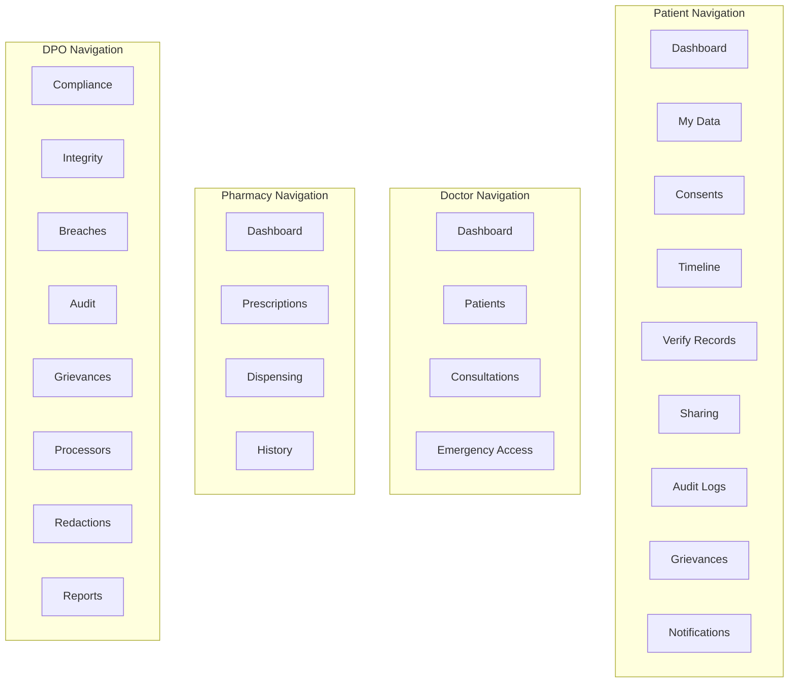
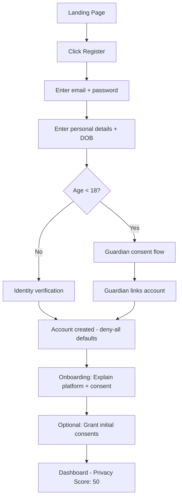
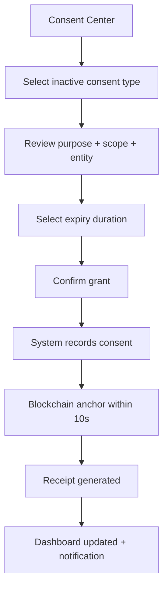
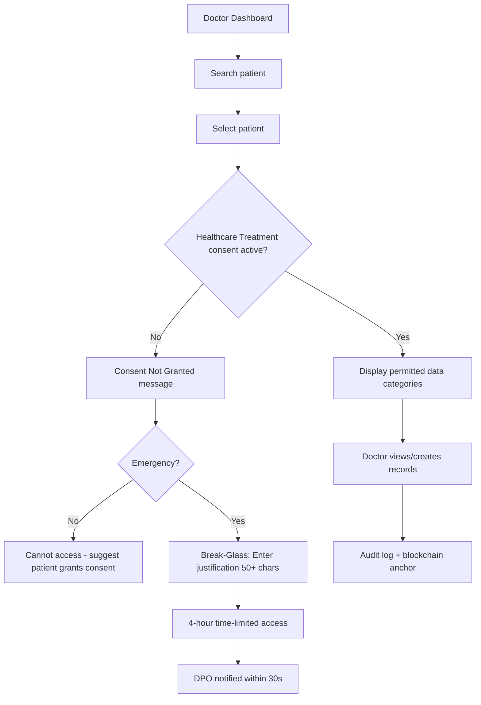

# UI/UX Design Document

## DPDP Compliant Redactable Blockchain Based Healthcare and Pharmacy Management System

---

## 1. Design System

### 1.1 Color Palette

| Token | Hex | Usage |
|-------|-----|-------|
| `--primary-50` | `#EFF6FF` | Primary background tint |
| `--primary-100` | `#DBEAFE` | Card hover states |
| `--primary-500` | `#3B82F6` | Interactive elements |
| `--primary-600` | `#2563EB` | Primary buttons |
| `--primary-700` | `#1E40AF` | Primary text, headers |
| `--primary-900` | `#1E3A5F` | Dark text on light backgrounds |
| `--saffron-100` | `#FFF3E0` | Warning background |
| `--saffron-400` | `#FFB74D` | Warning indicators |
| `--saffron-500` | `#FF9933` | Secondary accent, highlights |
| `--saffron-600` | `#F57C00` | Warning text |
| `--green-100` | `#DCFCE7` | Success background |
| `--green-500` | `#16A34A` | Success states, verified badges |
| `--green-600` | `#15803D` | Success text |
| `--red-100` | `#FEE2E2` | Error/violation background |
| `--red-500` | `#EF4444` | Error states, integrity violations |
| `--red-600` | `#DC2626` | Critical alerts |
| `--neutral-0` | `#FFFFFF` | Page background |
| `--neutral-50` | `#F9FAFB` | Card backgrounds |
| `--neutral-100` | `#F3F4F6` | Section dividers |
| `--neutral-200` | `#E5E7EB` | Borders |
| `--neutral-400` | `#9CA3AF` | Placeholder text |
| `--neutral-600` | `#4B5563` | Body text |
| `--neutral-800` | `#1F2937` | Headings |
| `--neutral-900` | `#111827` | Primary text |

### 1.2 Typography

| Token | Font | Weight | Size | Usage |
|-------|------|--------|------|-------|
| `heading-1` | Inter | 700 | 30px / 2rem | Page titles |
| `heading-2` | Inter | 600 | 24px / 1.5rem | Section titles |
| `heading-3` | Inter | 600 | 20px / 1.25rem | Card titles |
| `heading-4` | Inter | 500 | 16px / 1rem | Subsection titles |
| `body-large` | Inter | 400 | 16px / 1rem | Primary body text |
| `body-regular` | Inter | 400 | 14px / 0.875rem | Default body text |
| `body-small` | Inter | 400 | 12px / 0.75rem | Captions, metadata |
| `label` | Inter | 500 | 14px / 0.875rem | Form labels |
| `mono` | JetBrains Mono | 400 | 13px / 0.8125rem | Hashes, UUIDs, timestamps |

### 1.3 Spacing Scale

| Token | Value | Usage |
|-------|-------|-------|
| `space-1` | 4px | Tight inline spacing |
| `space-2` | 8px | Icon-to-text gap |
| `space-3` | 12px | Compact element padding |
| `space-4` | 16px | Standard card padding |
| `space-5` | 20px | Section gap |
| `space-6` | 24px | Card internal spacing |
| `space-8` | 32px | Section spacing |
| `space-10` | 40px | Page section gaps |
| `space-12` | 48px | Major section dividers |

### 1.4 Border Radius

| Token | Value | Usage |
|-------|-------|-------|
| `radius-sm` | 4px | Badges, chips |
| `radius-md` | 8px | Buttons, inputs |
| `radius-lg` | 12px | Cards |
| `radius-xl` | 16px | Modal dialogs |
| `radius-full` | 9999px | Avatars, pills |

### 1.5 Shadows

| Token | Value | Usage |
|-------|-------|-------|
| `shadow-sm` | `0 1px 2px rgba(0,0,0,0.05)` | Subtle elevation |
| `shadow-md` | `0 4px 6px rgba(0,0,0,0.07)` | Cards |
| `shadow-lg` | `0 10px 15px rgba(0,0,0,0.1)` | Dropdowns, modals |

### 1.6 Icons

- **Library**: Lucide React (consistent, accessible, MIT licensed)
- **Size**: 16px (inline), 20px (buttons), 24px (navigation), 32px (dashboard widgets)
- **Style**: Outlined, 1.5px stroke weight
- **Color**: Inherit from parent or use semantic color tokens

### 1.7 Component Library (Shadcn UI)

| Component | Usage |
|-----------|-------|
| Button | Primary, secondary, outline, ghost, destructive variants |
| Card | Dashboard widgets, data display containers |
| Dialog | Confirmations, consent grant, deletion requests |
| Badge | Status indicators, counts, categories |
| Table | Audit logs, access logs, prescription lists |
| Tabs | Data categories, consent types, dashboard views |
| Toast | Success/error notifications |
| Select | Role selection, category filtering |
| Input | Form fields with validation states |
| Textarea | Justification text, grievance description |
| Tooltip | Hash previews, field explanations |
| Progress | Privacy score, SLA countdown |
| Alert | Integrity violations, breach warnings |
| Avatar | User profiles, accessor icons |
| Calendar | Consent expiry, appointment dates |
| Accordion | Data categories, version history |
| Sheet | Mobile navigation, detail panels |

---

## 2. User Personas

### 2.1 Patient (Data Principal)

| Attribute | Description |
|-----------|-------------|
| **Name** | Rajesh Kumar, 42, Chennai |
| **Tech Level** | Moderate (smartphone user, uses UPI, familiar with government portals) |
| **Goals** | View health records, control who sees data, verify record integrity |
| **Pain Points** | Worried about data misuse, confused by consent forms, wants transparency |
| **Key Tasks** | Check privacy score, review access timeline, manage consents, verify records |
| **Design Need** | Simple language, visual indicators, one-click actions, clear status badges |

### 2.2 Doctor

| Attribute | Description |
|-----------|-------------|
| **Name** | Dr. Priya Sharma, Cardiologist, 35 |
| **Tech Level** | High (uses EMR daily, familiar with clinical systems) |
| **Goals** | Quick patient record access, create consultations, handle emergencies |
| **Pain Points** | Time pressure, consent barriers during emergencies, documentation burden |
| **Key Tasks** | Search patient, view records, create consultation, invoke break-glass |
| **Design Need** | Fast workflows, minimal clicks, clear consent status, emergency access prominent |

### 2.3 Pharmacy Staff

| Attribute | Description |
|-----------|-------------|
| **Name** | Amit Patel, Pharmacist, 28 |
| **Tech Level** | Moderate (uses POS systems daily) |
| **Goals** | View prescriptions, dispense medications, check allergies |
| **Pain Points** | Consent-blocked access, limited data visibility |
| **Key Tasks** | Look up prescription, verify allergy, record dispensing |
| **Design Need** | Focused interface (prescriptions + allergies only), clear consent indicators |

### 2.4 Admin (Healthcare Organization)

| Attribute | Description |
|-----------|-------------|
| **Name** | Vikram Reddy, IT Admin, 38 |
| **Tech Level** | High (system administrator) |
| **Goals** | Manage users, monitor system health, handle backups |
| **Pain Points** | Multiple systems, security responsibilities |
| **Key Tasks** | User management, system config, backup operations, authorize redactions |
| **Design Need** | Technical dashboards, bulk operations, system health indicators |

### 2.5 DPO (Data Protection Officer)

| Attribute | Description |
|-----------|-------------|
| **Name** | Dr. Kaushalya, DPO, 45 |
| **Tech Level** | High (legal + technical background) |
| **Goals** | Ensure DPDP compliance, manage breaches, authorize redactions, handle grievances |
| **Pain Points** | Volume of events, SLA pressure, regulatory reporting |
| **Key Tasks** | Review compliance dashboard, manage incidents, authorize redactions, generate reports |
| **Design Need** | Data-dense dashboards, SLA countdowns, one-click report generation, alert prioritization |

---

## 3. Screen Inventory

### 3.1 Patient Screens

| Screen | Route | Priority | Widgets/Sections |
|--------|-------|----------|------------------|
| Login | `/login` | P0 | Email, password, MFA, forgot password |
| Registration | `/register` | P0 | Personal details, age verify, guardian (if minor) |
| Dashboard | `/dashboard` | P0 | Profile, health summary, privacy score, consents, activity, integrity |
| Personal Data Center | `/my-data` | P0 | Categorized data view, edit, download, retention status |
| Consent Management | `/consents` | P0 | Consent cards per type, grant/withdraw actions |
| Data Usage Timeline | `/timeline` | P0 | Vertical timeline, filters, access cards |
| Audit Log Viewer | `/audit-logs` | P1 | Searchable table, filters, blockchain refs |
| Integrity Verification | `/verify` | P0 | Record list, verify button, status badges |
| Active Data Sharing | `/sharing` | P1 | Entity cards, revoke buttons, expiry indicators |
| Notifications | `/notifications` | P1 | Priority-sorted list, read/unread, actions |
| Grievance Portal | `/grievances` | P1 | Submit form, track status, history |
| Version History | `/history` | P2 | Field-level diffs, timeline view |

### 3.2 Doctor Screens

| Screen | Route | Priority |
|--------|-------|----------|
| Dashboard | `/doctor` | P0 |
| Patient Search | `/doctor/patients` | P0 |
| Patient Record View | `/doctor/patients/:id` | P0 |
| Consultation Form | `/doctor/consultations/new` | P0 |
| Emergency Access | `/doctor/emergency` | P0 |
| My Consultations | `/doctor/consultations` | P1 |

### 3.3 Pharmacy Screens

| Screen | Route | Priority |
|--------|-------|----------|
| Dashboard | `/pharmacy` | P0 |
| Prescription Lookup | `/pharmacy/prescriptions` | P0 |
| Dispensing Form | `/pharmacy/dispense/:id` | P0 |
| Dispensing History | `/pharmacy/history` | P1 |

### 3.4 Admin Screens

| Screen | Route | Priority |
|--------|-------|----------|
| Dashboard | `/admin` | P0 |
| User Management | `/admin/users` | P0 |
| System Configuration | `/admin/config` | P1 |
| Backup Management | `/admin/backups` | P1 |
| Blockchain Status | `/admin/blockchain` | P1 |

### 3.5 DPO Screens

| Screen | Route | Priority |
|--------|-------|----------|
| Compliance Dashboard | `/dpo` | P0 |
| Integrity Alerts | `/dpo/integrity` | P0 |
| Breach Center | `/dpo/breaches` | P0 |
| Audit Monitoring | `/dpo/audit` | P0 |
| Grievance Management | `/dpo/grievances` | P1 |
| Processor Management | `/dpo/processors` | P1 |
| Redaction Authorization | `/dpo/redactions` | P1 |
| Compliance Reports | `/dpo/reports` | P1 |

---

## 4. Navigation Architecture

### 4.1 Role-Based Sidebar Navigation



### 4.2 Header Structure

```
┌─────────────────────────────────────────────────────────────────────┐
│ [Logo] DPDP Healthcare Platform    [🔔 3] [Privacy: 78] [👤 Profile ▾] │
└─────────────────────────────────────────────────────────────────────┘
```

- Logo: Platform mark (healthcare + blockchain shield icon)
- Notification bell with unread count badge
- Privacy Score (patient only) as colored pill
- Profile dropdown: Settings, Help, Logout

---

## 5. Key Screen Designs

### 5.1 Patient Dashboard

```
┌─────────────────────────────────────────────────────────────────────┐
│ Welcome back, Rajesh                                    June 11, 2026│
├─────────────────────────────────────────────────────────────────────┤
│                                                                      │
│ ┌──────────────┐ ┌──────────────┐ ┌──────────────┐ ┌─────────────┐ │
│ │ Privacy Score│ │ Active       │ │ Data         │ │ Pending     │ │
│ │   [78/100]   │ │ Consents     │ │ Integrity    │ │ Requests    │ │
│ │  ████████░░  │ │     4        │ │  ✅ Verified │ │     1       │ │
│ │  Good        │ │              │ │  2h ago      │ │             │ │
│ └──────────────┘ └──────────────┘ └──────────────┘ └─────────────┘ │
│                                                                      │
│ ┌─────────────────────────────────┐ ┌──────────────────────────────┐│
│ │ Health Summary                  │ │ Recent Activity              ││
│ │ ┌─────────┐ ┌─────────┐       │ │                              ││
│ │ │Blood:O+ │ │Allergies│       │ │ • Dr. Sharma viewed Medical  ││
│ │ └─────────┘ └─────────┘       │ │   History — 2h ago           ││
│ │ Active Prescriptions: 3       │ │ • Consent renewed: Pharmacy  ││
│ │ Last Consultation: June 10    │ │   Access — 1 day ago         ││
│ │ Upcoming: July 10 (Follow-up) │ │ • Lab report added — 2d ago  ││
│ │                                │ │ • Prescription dispensed     ││
│ │ [View Full Health Profile →]   │ │   — 3 days ago              ││
│ └─────────────────────────────────┘ │ [View Full Timeline →]       ││
│                                      └──────────────────────────────┘│
│                                                                      │
│ ┌─────────────────────────────────────────────────────────────────┐ │
│ │ Consent Overview                                                 │ │
│ │ ┌────────────┐ ┌────────────┐ ┌────────────┐ ┌──────────────┐ │ │
│ │ │🏥Treatment │ │💊Pharmacy  │ │🔬Research  │ │📋Insurance   │ │ │
│ │ │  Active ✅ │ │  Active ✅ │ │ Inactive ⭕│ │ Active ✅    │ │ │
│ │ │Exp: 6 mon │ │Exp: 3 mon │ │            │ │Exp: 1 year  │ │ │
│ │ └────────────┘ └────────────┘ └────────────┘ └──────────────┘ │ │
│ │ [Manage All Consents →]                                         │ │
│ └─────────────────────────────────────────────────────────────────┘ │
└─────────────────────────────────────────────────────────────────────┘
```

### 5.2 Personal Data Center

```
┌─────────────────────────────────────────────────────────────────────┐
│ My Personal Data Center                          [⬇ Download All]   │
├─────────────────────────────────────────────────────────────────────┤
│ [All] [Personal] [Contact] [Identity] [Medical] [Prescriptions]     │
│                                                                      │
│ ┌─────────────────────────────────────────────────────────────────┐ │
│ │ Personal Information                    Retention: 6yr 7mo left │ │
│ │ ─────────────────────────────────────────────────────────────── │ │
│ │ Full Name    Rajesh Kumar         [✏ Edit]  ✅ Verified        │ │
│ │              Last modified: June 1  │  Blockchain: 0xabc...     │ │
│ │                                                                  │ │
│ │ Date of Birth  ••/••/1983          [View]   ✅ Verified        │ │
│ │              Encrypted at rest                                   │ │
│ │                                                                  │ │
│ │ Blood Group    O+                  [✏ Edit]  ✅ Verified        │ │
│ └─────────────────────────────────────────────────────────────────┘ │
│                                                                      │
│ ┌─────────────────────────────────────────────────────────────────┐ │
│ │ Contact Information                 Retention: 6yr 7mo left     │ │
│ │ ─────────────────────────────────────────────────────────────── │ │
│ │ Phone      +91-98765•••••         [✏ Edit]  ✅ Verified        │ │
│ │ Address    ••••, Chennai           [✏ Edit]  ✅ Verified        │ │
│ └─────────────────────────────────────────────────────────────────┘ │
│                                                                      │
│ ┌──────────────────────────────────────────────────────────────────┐│
│ │ Actions                                                          ││
│ │ [🗑 Request Data Deletion]  [📥 Download My Data]  [🔍 Verify All]││
│ └──────────────────────────────────────────────────────────────────┘│
└─────────────────────────────────────────────────────────────────────┘
```

### 5.3 Consent Management Center

```
┌─────────────────────────────────────────────────────────────────────┐
│ Consent Management                                                   │
├─────────────────────────────────────────────────────────────────────┤
│                                                                      │
│ ┌───────────────────────────────────────────────────────────────┐   │
│ │ 🏥 Healthcare Treatment                          [ACTIVE ✅]  │   │
│ │                                                                │   │
│ │ Purpose: Access to medical records for diagnosis and treatment │   │
│ │ Entity:  Apollo Healthcare Systems Pvt. Ltd.                   │   │
│ │ Scope:   Medical History, Allergies, Prescriptions, Lab Reports│   │
│ │ Granted: Feb 1, 2025    Expires: Feb 1, 2026 (8 months left) │   │
│ │ Blockchain: 0xabc123...def  ✅ Verified                       │   │
│ │                                                                │   │
│ │ [Modify Scope]  [Withdraw Consent]  [View Receipt]            │   │
│ └───────────────────────────────────────────────────────────────┘   │
│                                                                      │
│ ┌───────────────────────────────────────────────────────────────┐   │
│ │ 💊 Pharmacy Access                               [ACTIVE ✅]  │   │
│ │                                                                │   │
│ │ Purpose: Prescription dispensing and allergy verification      │   │
│ │ Entity:  Central Pharmacy Unit A                               │   │
│ │ Scope:   Prescriptions, Allergies                              │   │
│ │ Granted: Mar 15, 2025    Expires: Sep 15, 2025 (3 months)    │   │
│ │ ⚠️ Expiring soon                                              │   │
│ │                                                                │   │
│ │ [Modify Scope]  [Withdraw Consent]  [Renew]  [View Receipt]  │   │
│ └───────────────────────────────────────────────────────────────┘   │
│                                                                      │
│ ┌───────────────────────────────────────────────────────────────┐   │
│ │ 🔬 Research Access                              [INACTIVE ⭕]  │   │
│ │                                                                │   │
│ │ Purpose: Anonymized data for clinical research                 │   │
│ │ Scope:   Anonymized Medical History, Anonymized Lab Reports    │   │
│ │                                                                │   │
│ │ [Grant Consent]                                                │   │
│ └───────────────────────────────────────────────────────────────┘   │
└─────────────────────────────────────────────────────────────────────┘
```

### 5.4 Data Usage Timeline

```
┌─────────────────────────────────────────────────────────────────────┐
│ Data Usage Timeline                [Filter ▾] [Date Range] [Export] │
├─────────────────────────────────────────────────────────────────────┤
│ Summary: 12 accesses this week │ 3 today │ 45 this month           │
│                                                                      │
│ TODAY                                                                │
│ ─────                                                                │
│ ┌─────────────────────────────────────────────────────────────────┐ │
│ │ 🔵 11:30 AM  Dr. Priya Sharma (Cardiology)                     │ │
│ │    Viewed: Medical History, Allergies                            │ │
│ │    Reason: Cardiology consultation                              │ │
│ │    Duration: 3 minutes                                          │ │
│ │    Consent: Healthcare Treatment ✅                              │ │
│ └─────────────────────────────────────────────────────────────────┘ │
│       │                                                              │
│ ┌─────────────────────────────────────────────────────────────────┐ │
│ │ 🟢 3:30 PM  Central Pharmacy (Amit Patel)                      │ │
│ │    Viewed: Prescriptions                                        │ │
│ │    Reason: Prescription dispensing                               │ │
│ │    Duration: 1 minute                                           │ │
│ │    Consent: Pharmacy Access ✅                                   │ │
│ └─────────────────────────────────────────────────────────────────┘ │
│       │                                                              │
│ YESTERDAY                                                            │
│ ─────────                                                            │
│ ┌─────────────────────────────────────────────────────────────────┐ │
│ │ 🟠 9:15 AM  System (Integrity Check)                           │ │
│ │    Action: Batch integrity verification                         │ │
│ │    Result: All 12 records verified ✅                            │ │
│ └─────────────────────────────────────────────────────────────────┘ │
└─────────────────────────────────────────────────────────────────────┘
```

### 5.5 Integrity Verification Screen

```
┌─────────────────────────────────────────────────────────────────────┐
│ Data Integrity Verification                     [Verify All Records]│
├─────────────────────────────────────────────────────────────────────┤
│                                                                      │
│ Overall Status: ✅ All Records Verified (Last check: 2 hours ago)   │
│                                                                      │
│ ┌─────────────────────────────────────────────────────────────────┐ │
│ │ Record                    │ Status    │ Blockchain │ Last Verify │ │
│ │ ─────────────────────────────────────────────────────────────── │ │
│ │ Consultation (June 10)   │ ✅ Verified│ 0xabc...  │ 2h ago     │ │
│ │ Prescription #RX-5001    │ ✅ Verified│ 0xdef...  │ 2h ago     │ │
│ │ Lab Report (CBC)         │ ✅ Verified│ 0x012...  │ 2h ago     │ │
│ │ Personal Data            │ ✅ Verified│ 0x345...  │ 2h ago     │ │
│ │ Consent: Treatment       │ ✅ Verified│ 0x678...  │ 2h ago     │ │
│ └─────────────────────────────────────────────────────────────────┘ │
│                                                                      │
│ ┌─────────────────────────────────────────────────────────────────┐ │
│ │ How Verification Works                                          │ │
│ │                                                                  │ │
│ │  Your Record → SHA-256 Hash → Compare → Blockchain Hash         │ │
│ │       📄           #️⃣            ⚖️           ⛓️                  │ │
│ │                                                                  │ │
│ │  ✅ Match = Record unchanged since last blockchain anchor       │ │
│ │  🔴 Mismatch = Possible unauthorized modification              │ │
│ └─────────────────────────────────────────────────────────────────┘ │
│                                                                      │
│ ┌─────────────────────────────────────────────────────────────────┐ │
│ │ Chameleon Hash Explanation                                      │ │
│ │                                                                  │ │
│ │  Traditional Hash:  Change data → Hash changes → Chain breaks   │ │
│ │  Chameleon Hash:    Authorized change → Hash preserved → Valid  │ │
│ │                                                                  │ │
│ │  Formula: CH(m,r) = g^m · y^r mod p                            │ │
│ │  Only authorized personnel (DPO) can modify records while      │ │
│ │  maintaining blockchain integrity.                              │ │
│ └─────────────────────────────────────────────────────────────────┘ │
└─────────────────────────────────────────────────────────────────────┘
```

### 5.6 DPO Compliance Dashboard

```
┌─────────────────────────────────────────────────────────────────────┐
│ Compliance Overview                                    June 11, 2026 │
├─────────────────────────────────────────────────────────────────────┤
│                                                                      │
│ ┌──────────┐ ┌──────────┐ ┌──────────┐ ┌──────────┐ ┌──────────┐ │
│ │Compliance│ │ Active   │ │ Open     │ │ Pending  │ │ Integrity│ │
│ │ Score    │ │ Breaches │ │Grievances│ │ Erasures │ │ Alerts   │ │
│ │  97/100  │ │    1     │ │    3     │ │    2     │ │    0     │ │
│ │  ██████░ │ │  🔴HIGH  │ │  ⚠️ SLA  │ │ 48h left │ │  ✅ OK   │ │
│ └──────────┘ └──────────┘ └──────────┘ └──────────┘ └──────────┘ │
│                                                                      │
│ ┌────────────────────────────────────┐ ┌────────────────────────┐   │
│ │ Consent Activity (30 days)         │ │ Erasure SLA Tracker    │   │
│ │                                    │ │                        │   │
│ │ Grants: ████████████ 156           │ │ REQ-001: 48h remaining│   │
│ │ Withdrawals: ████ 42              │ │ REQ-002: 65h remaining│   │
│ │ Expirations: ██ 18                │ │                        │   │
│ │ Modifications: ███ 31             │ │ [View All Requests →]  │   │
│ └────────────────────────────────────┘ └────────────────────────┘   │
│                                                                      │
│ ┌─────────────────────────────────────────────────────────────────┐ │
│ │ Recent Critical Events                                          │ │
│ │ 🔴 12:00 Breach detected: Consent scope violation (Contained)  │ │
│ │ ⚠️ 09:00 Grievance #GRV-3001: Approaching 15-day SLA          │ │
│ │ 🟢 08:00 Monthly data residency check: PASSED                  │ │
│ │ 🟢 Yesterday: Key rotation completed for 847 patients          │ │
│ └─────────────────────────────────────────────────────────────────┘ │
└─────────────────────────────────────────────────────────────────────┘
```

---

## 6. Privacy Score Widget

### 6.1 Score Computation (Visual)

```
┌─────────────────────────────────┐
│     Privacy Score: 78/100       │
│     ████████████████░░░░        │
│          Good                   │
│                                 │
│ Breakdown:                      │
│ ├ Consent Coverage:    80%  ██████████░░  │
│ ├ Data Minimization:   75%  █████████░░░  │
│ ├ Encryption Status:   100% ████████████  │
│ └ Last Verification:   60%  ████████░░░░  │
│                                 │
│ 💡 Tip: Verify your records to │
│    improve your score           │
└─────────────────────────────────┘
```

### 6.2 Score Ranges

| Range | Label | Color | Badge |
|-------|-------|-------|-------|
| 90-100 | Excellent | `--green-500` | Shield with checkmark |
| 70-89 | Good | `--primary-500` | Shield outline |
| 50-69 | Fair | `--saffron-500` | Warning triangle |
| 0-49 | Needs Attention | `--red-500` | Alert circle |

---

## 7. Mobile Responsive Design

### 7.1 Breakpoints

| Breakpoint | Width | Layout Changes |
|------------|-------|----------------|
| Desktop | ≥ 1200px | Sidebar + full content area |
| Tablet | 768-1199px | Collapsible sidebar, 2-column cards |
| Mobile | 320-767px | Bottom navigation, single column, sheet panels |

### 7.2 Mobile Adaptations

| Element | Desktop | Mobile |
|---------|---------|--------|
| Navigation | Fixed left sidebar | Bottom tab bar (5 items) |
| Dashboard cards | 4-column grid | Single column stack |
| Data tables | Full table | Card-based list view |
| Timeline | Side-by-side details | Stacked vertical |
| Consent cards | Horizontal row | Vertical stack |
| Actions | Inline buttons | Bottom sheet with actions |
| Modals | Center dialog | Full-screen sheet |

---

## 8. Accessibility Design

### 8.1 WCAG 2.1 Level AA Compliance

| Requirement | Implementation |
|-------------|---------------|
| Color contrast (4.5:1 min) | All text meets minimum ratio; verified via design tokens |
| Keyboard navigation | All interactive elements focusable, logical tab order |
| Screen reader support | Semantic HTML, ARIA labels, live regions for alerts |
| Focus indicators | Visible 2px outline on focus (primary-500 color) |
| Error identification | Error messages linked to inputs, color + icon indicators |
| Text resizing | All text scales to 200% without loss of content |
| Touch targets | Minimum 44x44px for all interactive elements |
| Motion reduction | Respect `prefers-reduced-motion` media query |

### 8.2 Accessible Patterns

| Pattern | Implementation |
|---------|---------------|
| Status badges (Verified/Violation) | Color + icon + text (not color alone) |
| Form errors | Red border + error icon + descriptive message |
| Notifications | `role="alert"` for critical, `role="status"` for info |
| Data tables | Proper `<th>` headers, `scope` attributes |
| Timeline events | Semantic `<ol>` with ARIA labels per event |

---

## 9. UI Security Patterns

### 9.1 Sensitive Data Display

| Pattern | Implementation |
|---------|---------------|
| PII masking | Phone: +91-98765•••••, Aadhaar: ••••-••••-1234 |
| Reveal on demand | "Show" button with re-authentication for identity fields |
| Session timeout warning | Modal at 5 min before timeout with extend option |
| Copy protection | No clipboard access for sensitive fields by default |
| Screenshot warning | Watermark on sensitive data screens (patient ID visible) |

### 9.2 Authentication UX

| State | UI Behavior |
|-------|-------------|
| Session active | Normal navigation |
| Session expiring (5 min) | Floating banner: "Session expires in X:XX — Extend?" |
| Session expired | Redirect to login with return URL preserved |
| MFA required | Modal overlay, cannot dismiss until verified |
| Account locked | Error message with unlock time countdown |

### 9.3 Consent Action Confirmations

All consent changes require explicit confirmation:
```
┌─────────────────────────────────────────────┐
│ ⚠️ Withdraw Healthcare Treatment Consent?   │
│                                              │
│ This will immediately revoke access to your  │
│ medical records for all authorized doctors.  │
│                                              │
│ Affected entities: Apollo Healthcare         │
│ Data categories: Medical History, Allergies, │
│                  Prescriptions, Lab Reports  │
│                                              │
│ This action is recorded on blockchain.       │
│                                              │
│ [Cancel]                [Confirm Withdrawal] │
└─────────────────────────────────────────────┘
```

---

## 10. Error Handling UX

### 10.1 Error States

| Error Type | Display | Recovery Action |
|------------|---------|-----------------|
| Network error | Toast: "Connection issue. Retrying..." | Auto-retry 3x, then manual retry button |
| 401 Unauthorized | Redirect to login | Preserve intended destination |
| 403 Consent denied | Inline alert: "Consent not granted for this data" | Link to consent management |
| 404 Not found | Full-page empty state | Back navigation + support link |
| 429 Rate limited | Toast: "Too many requests. Please wait X seconds" | Auto-dismiss with countdown |
| 500 Server error | Full-page error with correlation ID | Retry button + support contact |
| Blockchain verification failure | Red alert banner with violation details | Contact DPO link |

### 10.2 Loading States

| Duration | Behavior |
|----------|----------|
| < 500ms | No indicator (instant feel) |
| 500ms - 2s | Skeleton loader (content shape placeholders) |
| 2s - 10s | Skeleton + progress bar (blockchain operations) |
| > 10s | Skeleton + "This is taking longer than expected" message |

---

## 11. User Flow Diagrams

### 11.1 Patient First-Time Registration



### 11.2 Consent Grant Flow



### 11.3 Doctor Patient Access Flow



---

## 12. Design Tokens Summary

```
// Colors
--color-primary: #1E40AF
--color-primary-light: #3B82F6
--color-secondary: #FF9933
--color-success: #16A34A
--color-error: #EF4444
--color-warning: #F57C00
--color-background: #FFFFFF
--color-surface: #F9FAFB
--color-border: #E5E7EB
--color-text-primary: #111827
--color-text-secondary: #4B5563
--color-text-muted: #9CA3AF

// Typography
--font-family: 'Inter', sans-serif
--font-mono: 'JetBrains Mono', monospace
--font-size-base: 14px
--line-height-base: 1.5

// Spacing
--spacing-unit: 4px
--content-max-width: 1280px
--sidebar-width: 260px
--header-height: 64px

// Transitions
--transition-fast: 150ms ease
--transition-normal: 250ms ease
--transition-slow: 350ms ease

// Z-index
--z-dropdown: 100
--z-modal: 200
--z-toast: 300
--z-tooltip: 400
```

---

## 13. Component Hierarchy

```
App
├── AuthProvider (context)
├── ThemeProvider (light only)
├── Router
│   ├── PublicRoutes
│   │   ├── LoginPage
│   │   └── RegisterPage
│   └── ProtectedRoutes (role-gated)
│       ├── AppShell
│       │   ├── Header
│       │   │   ├── Logo
│       │   │   ├── NotificationBell
│       │   │   ├── PrivacyScorePill (patient only)
│       │   │   └── ProfileDropdown
│       │   ├── Sidebar
│       │   │   └── RoleBasedNav
│       │   └── MainContent
│       │       └── [Page Component]
│       ├── PatientRoutes
│       ├── DoctorRoutes
│       ├── PharmacyRoutes
│       ├── AdminRoutes
│       └── DPORoutes
├── ToastProvider
└── DialogProvider
```
