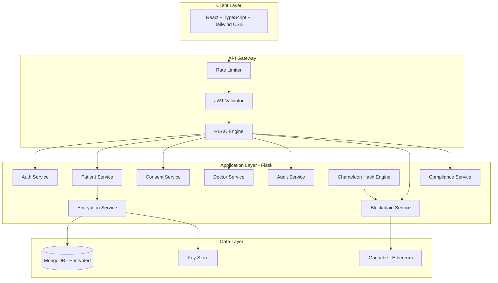

# DPDP-Compliant Redactable Blockchain Based Healthcare & Pharmacy Management System

> A production-grade healthcare platform demonstrating compliance with India's Digital Personal Data Protection Act (DPDP Act, 2023) through privacy-first design, consent management, AES-256 encryption, blockchain verification, and Chameleon Hash-based authorized redaction.

---

## Architecture



## Key Features

| Feature | Implementation |
|---------|---------------|
| **DPDP Consent Management** | 6 consent types with blockchain-anchored receipts |
| **AES-256 Encryption** | Field-level Fernet encryption for all PII |
| **Blockchain Anchoring** | SHA-256 hashes stored on Ganache (Ethereum) |
| **Chameleon Hashing** | Authorized redaction preserving chain validity |
| **Right to Correction** | Version-preserved corrections with proof chain |
| **Right to Erasure** | Field redaction with blockchain proof |
| **Consent-Gated Access** | Doctor access requires active patient consent |
| **Immutable Audit Trail** | Hash-chained, blockchain-anchored logs |
| **Compliance Scoring** | Real-time DPDP compliance score (0-100) |
| **Integrity Verification** | On-demand blockchain hash comparison |

## Technology Stack

| Layer | Technology |
|-------|-----------|
| Frontend | React 18, TypeScript, Vite, Tailwind CSS, Shadcn UI, TanStack Query, Recharts, Framer Motion |
| Backend | Flask 3, Python 3.11 |
| Database | MongoDB 7 |
| Blockchain | Ethereum (Ganache), Web3.py |
| Encryption | AES-256-GCM (Fernet / cryptography) |
| Auth | JWT (PyJWT), bcrypt |
| Documentation | Swagger/OpenAPI (Flasgger) |

## Quick Start

### Prerequisites

- Python 3.11+
- Node.js 20+
- MongoDB 7.x (running on localhost:27017)
- Ganache (optional, for blockchain features)

### Setup

```bash
# Clone
git clone <repository-url>
cd dpdp_kiro

# Backend
cd backend
python -m venv venv
venv\Scripts\activate          # Windows
pip install -r requirements.txt
python -m app.db_init          # Initialize MongoDB collections
python seeds/seed_demo.py      # Seed demo data
python run.py                  # Start API on :5000

# Frontend (new terminal)
cd frontend
npm install
npm run dev                    # Start UI on :5173
```

### Docker (Alternative)

```bash
docker-compose up --build
```

## Demo Credentials

| Email | Password | Role |
|-------|----------|------|
| `admin@dpdp-health.in` | `Admin@Secure123` | Admin/DPO |
| `rajesh.kumar@gmail.com` | `Patient@123` | Patient |
| `priya.sharma@gmail.com` | `Patient@456` | Patient |
| `amit.patel@gmail.com` | `Patient@789` | Patient |

## API Documentation

After starting the backend:
- **Swagger UI**: http://localhost:5000/api/docs/
- **Health Check**: http://localhost:5000/health

## API Endpoints

| Method | Endpoint | Auth | Description |
|--------|----------|------|-------------|
| POST | `/api/v1/auth/register` | — | Register (patient/doctor/admin) |
| POST | `/api/v1/auth/login` | — | Login → JWT |
| GET | `/api/v1/patients/me` | Patient | Own profile |
| GET | `/api/v1/patients/me/records` | Patient | Own health records |
| POST | `/api/v1/patients/me/records/:id/correct` | Patient | Correct record (DPDP) |
| POST | `/api/v1/patients/me/records/:id/erase` | Patient | Erase record (DPDP) |
| POST | `/api/v1/consents/grant` | Patient | Grant consent |
| POST | `/api/v1/consents/:id/withdraw` | Patient | Withdraw consent |
| GET | `/api/v1/doctors/patients/search` | Doctor | Search patients |
| GET | `/api/v1/doctors/patients/:id/records` | Doctor | Consent-gated access |
| GET | `/api/v1/integrity/record/:id` | Patient | Verify record integrity |
| GET | `/api/v1/audit/timeline` | Patient | Audit event timeline |
| GET | `/api/v1/compliance/compliance-score` | Admin | DPDP compliance score |

## Project Structure

```
dpdp_kiro/
├── backend/
│   ├── app/
│   │   ├── blueprints/        # API routes (auth, patients, consents, doctors, audit, blockchain, integrity, compliance)
│   │   ├── services/          # Business logic (9 services)
│   │   ├── middleware/        # JWT, RBAC, audit decorators
│   │   ├── utils/             # Helpers, constants, errors
│   │   └── swagger_config.py  # API documentation
│   ├── seeds/                 # Demo data generator
│   ├── tests/                 # 80+ automated tests
│   └── requirements.txt
├── frontend/
│   ├── src/
│   │   ├── pages/             # 10 feature pages
│   │   ├── components/        # Reusable UI (cards, badges, gauges, timelines)
│   │   ├── services/          # API client layer
│   │   ├── contexts/          # Auth + Query providers
│   │   └── layouts/           # AppShell with role-based navigation
│   └── package.json
├── docker-compose.yml
└── .kiro/specs/               # Design documentation (requirements, architecture, security, blockchain, compliance)
```

## Testing

```bash
cd backend
python -m pytest tests/ -v     # Run all tests
python -m pytest tests/ -q     # Quick summary
```

**Test Coverage**: 80+ automated tests covering auth, encryption, blockchain, consents, audit, compliance, and chameleon hash integration.

## Research Contribution

This system demonstrates a novel architecture combining:

1. **Chameleon Hash Functions** for authorized blockchain modifications
2. **DPDP Act Compliance** with blockchain-verified consent management
3. **Dual Integrity Model** — hash chain + blockchain anchoring
4. **Consent-Augmented RBAC** — role permissions + purpose-limited consent

The Chameleon Hash simulation allows evaluators to visualize how traditional blockchain immutability conflicts with data protection rights, and how authorized hash collisions resolve this tension.

## DPDP Act Compliance

| DPDP Section | Right/Obligation | Implementation |
|---|---|---|
| Section 5-6 | Consent | 6 consent types, receipts, blockchain-anchored |
| Section 11 | Right to Access | Personal Data Center, data export |
| Section 12 | Right to Correction | Chameleon hash correction workflow |
| Section 12 | Right to Erasure | Chameleon hash redaction workflow |
| Section 8(4) | Security Safeguards | AES-256, RBAC, audit logging |
| Section 8(6) | Breach Notification | Audit trail with severity levels |

## License

Academic Project — All Rights Reserved.
